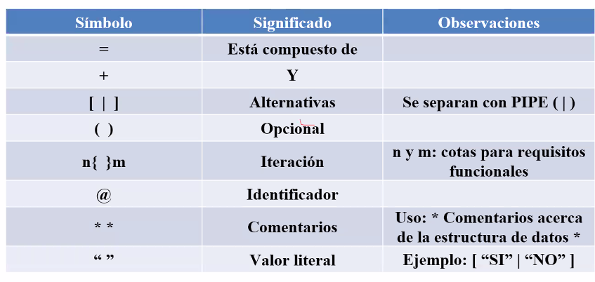
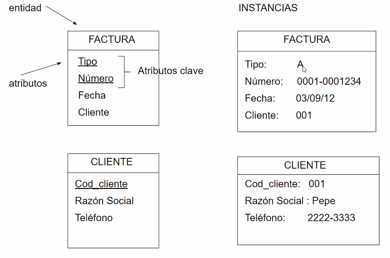

# ADS 2do cuatrimestre

## Analisis estructurado

* Enfoque top down: va desde lo mas general a lo mas especifico

* Ventajas:
    - Mejora interaccion con el usuario y team de proyecto
    - Provee herramientras de documentacion
    - Permite refinar el modelo logico
    - Abstraccion de los aspectos fisicos de la implementacion

### Diagrama de contexto
- Representa el nivel mas alto de abstraccion
- Se considera al sist. como un unico proceso.
- Se define a las ent externas con las que interactua.
- Se miran las entradas/salidas.

* **Entidad externa**: 
    - Representa el entorno del sistema
    - es origen/destino logico de la info del sistema.
    - las entidades externas no se relacionan entre si (_Por lo menos en el modelo, en la vida real si puede ocurrir_)
* Ejemplos:
    - Organizacion externa  un proovedor
    - Area de la organizacion: Compras
    - UN rol de la org:  jefe de deposito
    - Otro sistema: sistema de liquidacion de sueldos

**Sistema**:
Representa la funcionalidad completa del ssitema

**Flujo de datos**: Representa una relacion de datos logicos entre el entorno y el sistema. (sentido unidireccional)

* Se deben colocar nombres logicos y no fisicos:
`Nombre logico: Vtos. a pagar`
`Nombre fisico: Datos de planilla` 

### DFD
* Representa descripcion grafica de los subsitemas logicos y sus movimiento/almacen de datos logicos.

**Lista de eventos**
- Un listado jerarquico que determina funciones/procesos que se utilizaran en el DFD
1. Gestionar proveedores
1. Registar deuda
1. Determinar vtos a pagar
1. Emitir orden de pago

**Entidad externa**
- Se mantienen las del DC

**Proceso o funcion**
- Representa una funcion logica interna del sist.
- Representan un trabajo del sistema, que provoca un cambio o transformacion de los datos
- El nobmre representa la actividad realizada
- Recibe uno o mas flujo de datos entrada
- Genera uno o mas flujos de datos de salida
- Puede especificarse con:
    - Arbol de decision
    - Tabla de decision

**Almacenamiento/Demora**
- Representa un deposito logico de datos en el sistema, se almacenan temporalmente para usarse luego
- Los flujos de origen significan una CONSULTA de los datos
- Los flujos de destino significan una INSERCION, ACTUALIZACION de los datos.

**Flujo de datos**

- No deberia haber dos FD con el mismo nombre (_Excepto FD entrante y saliente a un mismo almacenamiento_)

**Flujo temporal**
- Representa la activacion periodica de un proceso
- No posee origen
- Destino: proceso
- En el nombre se indica freecuencia de activacion.

* Una entidad externa no puede tener un flujo directo a un almacenamiento

### Diccionario de datos
- Un listado ordenado alfabeticamente que describe todos los datos que adminsitra el sistema
- Elimina redundancias

## Der
* Representa mediante un modelo de red los datos almacenados o persistidos en el sistema

* Compuesto por:
- Entidades: 
    - es una idea relevante del negocio que estoy modelando
    - Compuiesto por atributos y relaciones
    - Posee una clave que permite identificar de forma unica la ocurrencia de una entidad

- Atributos: son caracteristicas/propiedades asociadas a una entidad
    - valores en una instancia en particular
    

Ejemplo:     

- Relaciones:
    - Indican como se relacionan las entidades
    - Cardinalidad: numero maximo de instancias con la que puede relacionarse una entidad con otra.
    - Modalidad: Numero minimo de instancias con las que puede relacionarse una entidad con otra

### Normalizacion
1. Eliminar datos calculador
1. Los campos no claves dependen completamente de la clave 
1. 