# Sistemas operativos

## Repaso arquitectura

### Arquitectura 
* IR Instruction register =guarda  la instruccion explicitamente que se va a ejecutar 

* PC program counter= Es donde va la direccion de memoria de la proxima instruccion

* Execution unit= Lugar donde se ejecuta la instruccion 

* Memory addres register= nos indica donde esta el operando que tenemos que buscar en la memoria

* Memory bugger register= Aca va el operando en si 
`Monospace?`
\
### Registros

* Variables= Tienen un tamanio limitado en memoria

* Flags= Bits que indican si ocurre o no algo (_durante la ejecucion de instrucciones estas flags van cambiando_)

* Flag (0)= se prende cuando la ultima cuenta dio 0

* Flag (Overflow)= Indica exceso de uso de memoria en una variable. (_Si se excede el tamanio la variable pasa a 0_)

### Ciclo de ejecucuion de instruccion

Pasos para ejecutar una instruccion

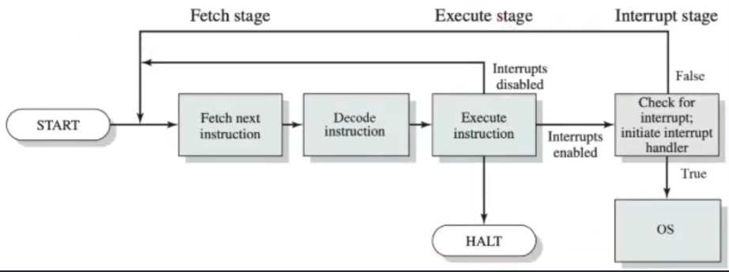

* Los valores de la memoria son llevados a la cpu para ejecutar la instuccion. 

* Las interrupcion solo se atiende entre un ciclo de instruccion y otro (_No afecta en el proceso de ejecucion una instruccion_)

`No pueden aparecer en el proceso= Fetc-->Decode-->Execute `

### Interrupciones

* Flujo normal= Seria lo que el programa haria si no hubiera ninguna interrupcioon

Es un mecanismo mediante el cual los modulos de i/o O la cpu pueden interrumpir el flujo normal de ejecucion.

Clasificacion:

1. Enmascarables: No son de tan gran importancia, se puede posponer su atencion. (_Son ignorables_) 
1. No enmascarables: Son interrupciones que se antienden si o si en el momento que ocurren (_Son criticas_ ) 
1. Hardware = Son enviadas por un ente externo a la cpu (un dispositivo)
1. Software = Son enviadas por la misma cpu a si misma, como consecuencia de la ejecucion de una instruccion. (division x zero)

* Hay prioridades en las instrucciones, algunas son atendidas antes que otras.

* El sistema operativo es el que atiende la interrupcion y trata de solucionar dicho problema.

Cuando se esta ejecutando un programa y surge una interrupcion, esta se atiende y luego sigue por donde iba el programa antes de que surja dicha interrupcion. 

* El interrupt hander es el encargado de manejar las instrucciones


* El clock de la cpu es un dispositivo a parte de la cpu, que envia interrupciones enmascarables notificando el cambio de tiempo


## Sistemas operativos

* Kernels= Es el nucleo sobre el cual se realizan las distribuciones (agregandole aplicaciones, disenos, etc)

El sistema operativo en si es un programa de software, encargado de adminisitrar recursos (hardware/ otros programas) le permite a los programas hacer uso de la cpu, memoria, etc. Tambien se encarga de proveer y administrar la seguridad.
Hacer de interfaz entre el usuario y el programa. 
Se administra a si mismo.

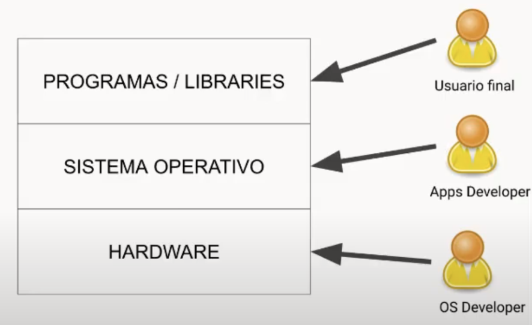


### Seguridad
Comienza por el hardware, dividiendo las instrucciones en privilegiadas y comunes.
* Privilegiadas: Tienen funciones criticas y no cualquiera las puede mandar

`Cli= deshabilita interrupciones enmascarables, STI las activa`

Tambien se dividen los modos de ejecucion
* Usuario: un modo usado por los programas
* Kernel: Solo el SO puede usarlo.

Las instrucciones del SO corren en modo kernel (_privilegiadas y comunes_) y las instrucciones de programa en modo usuario (_comunes_)

* El so arranca en modo kernel (_cargado en un lugar predefinido del disco_). Primero se inicia el firmware (bios) y esta ejecuta el SO.

##### Como hace un programa para hacer uso de los recursos de la pc entonces?
Haciendo uso de la llamada al sistema (syscall), mediante la cual le solicitan servicios al SO.
estas llamadas al syscall se realizan cuando requieren ejecutar instrucciones privilegiadas.
* Todas estas syscall son de alto nivel

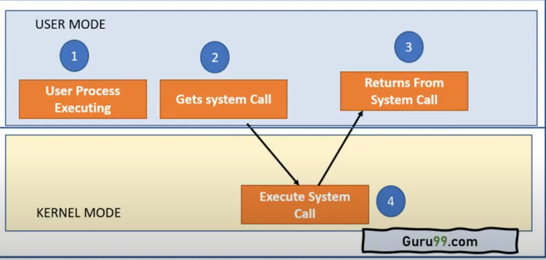

* El app developer solo conoce las syscalls que le ofrece el SO.

* Wrappers= Funciones de usuario que ofrecen una interfaz mas sencilla, portable y eficiente para realizar syscalls mas complejas.  


## Procesos

* Inicialmente los So's eran monoprogramados (_es decir una sola tarea/programa a la vez_)

Uniprograming:
|RUN||Wait||Run||Wait|

Multiprograming:

``` 
P1: Run |Wait|Run |Run|
P2: Wait|Run |Wait|
``` 
_Ocurre intercalamiento/concurrencia, ya que se van alternando el tiempo que usan en la cpu segun lo requieren._

* La cpu solo puede ejecutar 1 proceso a la vez.

* Las interfaces (Bash, Zsh, Gnome), son de intermediario entre el programa y el kernel. 


Como esta compuesto un proceso?
* Por: 
    - Secuencia de instrucciones
    - Conjunto datos: Variables, pila de ejecucuion _En la ram_
    - Estado: Contexto de ejecucion, prioridad, exit status
    - Conjunto de atributos: process id, user id.
    - Recursos asignados: Archivos abiertos, etc.

* Imagen del proceso:
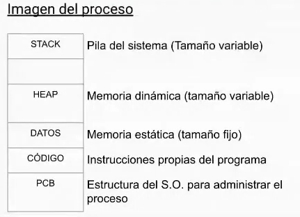    
    - Heap: va variando en tiempo de ejecucion (malloc y free)
    - Datos: estatica, se reserva al inicio y se libera al final (finalizacion del proceso) _ej: una variable global_
    - Stack: 
        - Variables locales / parametros: que se usan en las funciones
        - Direcciones de retorno de las funciones: saber cual es la direccion para continuar ejecutando antes de haber entrado a dicha funcion.

* Ejemplo de guardado: 
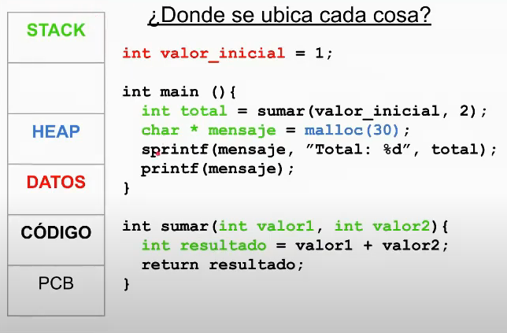

`Aclarcion muy importante: Porque char * mensaje va en el stack ? esto es porque el puntero a un tipo de dato char es una variable local, pero el espacio donde se encuentra guardado el contenido de mensaje eso si va al HEAP, ya que esto si ocupa espacio de memoria`

`Resumen: Mensaje contiene un puntero que tiene una direccion del heap`

Que es el PCB? Es el process control block y es una struct que arma el SO para administrar un proceso, via esta estructura conoce la informacion necesaria para manipularlo.

* Que contiene el PCB? :
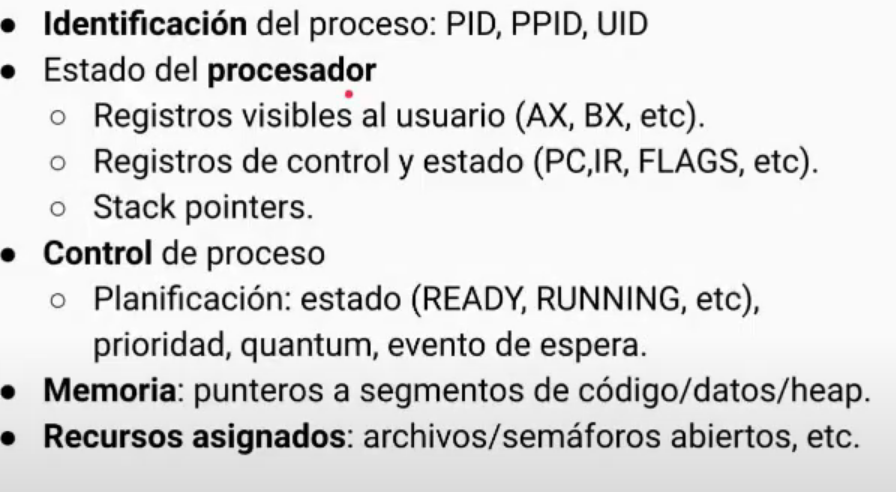


* Suspender un proceso: sacarlo de la memoria ram

### Algunas defeniciones:
* Programa: secuencia de instrucciones compiladas a codigo maquina
* Ejecucion concurrente: Ejecucion de dos o mas programaas durante un mismo intervalo de tiempo (compartir o competencia por recursos).
* Multiprogramacion: modo de opreacion en el cual 2 o mas programas ejecutan concurrentemente.


*Si se bloquea un proceso no sera nunca por la espera de algo de el mismo*

### Estados del proceso:
* Los procesos pueden ser creados por el SO o por otro proceso.
* Los procesos pueden ser finalizado por:
    - EL So
    - Otro proceso
    - Mismo proceso (Normal exit, abnormal exit). _via syscall le pide finalizar_
 
* Un proceso son entidades que:
    - Aisladas: no comparten recursos, para hacerlo dependen del SO (interprocess comunicaction _provistas por syscalls)    
    - Independientes: No necesitan de otro proceso (padre, hijo, hermano, etc).

_Que no compartan informacion no significa que nunca lo hagan, sino que no es algo necesario, pero podria ocurrir._

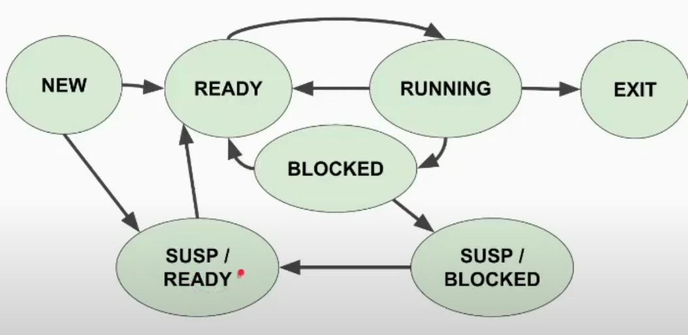

* Estados: 
    - New: el proceso esta siendo creado (las esctructuras necesarias)
    - Ready: esta listo para ejecutar
    - Running: Esta usando la cpu y ejecutando sus instrucciones
    - Blocked: esperando un evento (ej: entrada/salida, paso del tiempo, cambio de un valor de algo, un msj de otro proceso, etc) _Luego se envia una interrupcion para avisar que ya esta ready_

    - Exit: Es cuando el proceso finalizo, pero aun queda algo pendiente por hacer, no puede volver jamas a running de este estado, luego se liberan todos los datos salvo el PCB. (de aca se pueden recolectar estadisticas de ejecucion o que ocurrio con su ejecucion) `Se puede llegar a este estado desde cualquier otro`

* Susp/Ready: Ya esta en la ram (se trajo del disco la snapshot)
* Susp/Blocked: Mucho tiempo esperando al pedo entonces lo saco de memoria ram y lo llevo al disco.

`El PCB de un proceso siempre esta en memoria ram`
* El estado S, nos indica sleeping, que el proceso esta bloqueado.


Porque un proceso cambia constantemente su PID ? Porque este no es el mismo, sino que se ejecuta un nuevo proceso constantemente. 

### Syscalls bloqueantes y nobloqueantes

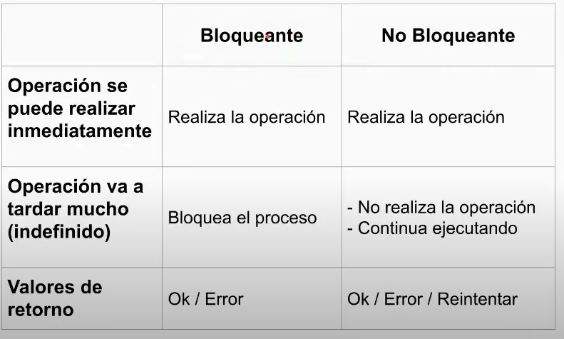

```
* Un proceso puede ejecutar las siguientes funciones para obtener su ID:
 - getpid(void);
 - getppid(void); _id del padre_

Forma de enviar una senial para matar un proceso ejemplo:
* kill -SIGTERM (esto seria la senial amigable) 2743 (seria el PID)

Otra senial que se le puede enviar al proceso es una para que pare/continue un proceso
* Kill -SIGSTOP [PID]
* Kill -SIGCONT [PID]
```

### Procesos Zombies

Suponiendo el caso que matemos un proceso padre, que pasa con el hijo? bueno este sigue ejecutando por un tiempo y es manejado por un proceso abuelo, pero este mismo al ver que no tiene nada para hacer decide finalizarlo

* fork();  // Esta funcion se encarga de crear un proceso, clonandolo.


### Cambio de proceso
Cuando ocurre esto?
- Interrupciones (HW/SW)
- Syscall

Proceso de como ocurre:
1. Interuption
1. HW: Stack -> PC & PSW(se guarda el contexto del proceso)
1. HW: PC -> SO routine && mode switch (user->kernel)
1. SO: Stack -> se guardan el resto de los registros del proceso
1. SO: Decides to switch procces.
1. SO: A`s PCB -> PC, PSW y el resto (del stack del sistema) es guardado todo en el PCB  
1. SO: A`s PCB.state -> Ready 
1. SO: Ready queue -> A`s PCB
1. SO: Elige otro proceso B 
1. SO: B`s PCB .state ->Running
1. SO: Memory management register -> B`s limits
1. SO: Processor state -> PCB B (PC,PSW,etc) && mode switch (kernel->user)

## Planificacion 

Es la planificacion y la administracion para que se ejecuten todos los procesos que se quieren ejecutar, es la gestion

* El recurso "Tiempo" de la cpu es limitado.


#### Como lograr una multiprogramacion eficiente ?
Con una buena planificacion, hay de 3 tipos:

1. Largo plazo: decide si agregar un proceso o no a la lista de proceso a ser ejecutados.
(_Esta mas relacionado con el grado de carga del sistema y nivel de multiprogramacion_)

1. mediano plazo: decide si agregar un proceso a aquellos que se encuentran parcial o totalmente en la memoria. (_igual que el largo plazo, esta relacionado con el nivel de multiprogramacion_)

* El largo y mediano plazo : suele ser muy relevante en sistemas criticos

1. corto plazo: decide cual proceso disponible actualmente usara el procesador, ejecuta con la mayor frecuencia. 

*Sistemas criticos: tienen en cuenta el stress para aceptar o no procesos


*Nivel de multiprogramacion: cantiad de procesos activos en memoria principal. _que tan estresado esta el sistema_

#### Criterios para evaluar planificadores

`Orientado al proceso/ usuario`
* Tiempo de ejecucion: es el tiempo que esta el proceso ejecutando en el cpu
* Tiempo de espera: representa todo el tiempo que estuvo el proceso en esperar para ejecutar (ready)
* Tiempo de respuesta: es el tiempo que pasa desde que entra el proceso al sistema y hace la primer entrada/salida.

`Orientado al sistema`
* Tasa de procesamiento: cantidad de procesos por segundo. 

* Overhead: Burocracia excesiva causada por mucho tiempo del SO usando la cpu en sus tareas administrativas

### Algoritmos de planificacion de CORTO PLAZO
Siempre los Sistemas operativos usa un solo algoritmo, que conlleva varias estrategicas, pero una vez que arranca este no cambia.

* Estos algoritmos son unicamente para el uso de CPU (no afecta a E/S).

#### FIFO (First in First Out)
En este tipo de planificacion, el primer proceso que llega es el primero que ejecuta.

* Rafagas : son las unidades de tiempo en las cuales esta haciendo uso de la CPU un proceso.

* El sistema operativo nunca sabe cual es el proximo proceso que va a venir.

Cuando llega un proceso y esta ejecutando uno, este se queda en ready esperando que se desocupe el uso de la cpu para utilizarlo.

* No importa si hay un proceso que esta ejecutando y este deja de hacer uso de la cpu para hacer una instruccion de entrada salida, cuando se vuelva a incorporar para hacer uso del cpu ira ultimo en la cola.

#### SFJ (Shortest Job First, Sin desalojo*)

Se ejecuta aquel que tenga la proxima rafaga mas corta.

* No importa el orden de llegada.

* El criterio de para E/S es FIFO, no importa

* Starvation (Inanicion): Ocurre cuando un proceso eventualmente no podria ejecutar nunca, porque otros procesos podrian "colarse" constantemente y nunca se lleve a cabo su ejecucion.

* Es imposible saber cual va a ser la rafaga del proximo proceso, por eso se realiza una estimacion. (Imposible su implementacion en su version pura).

Formula de promedio exponencial: `EST n+1 = a * TEn + (1-a) * ESTn`

```
TEn= Tiempo de ejecucion de la rafaga actual (inmediatamente anterior)
ESTn= Tiempo de estimado para la rafaga actual
ESTn+1= Tiempo estimado para la proxima rafaga
a= costante entre 0 y 1
```
* Un alpha mas grande, reacciona mas rapido, pero es mas desventajoso a la hora de unas rafagas mas constantes en cuanto su duracion. (le da mucho peso a lo ocurrio previamente con la rafaga anterior)

* Un alpha mas chico, por su lado es mas lento en reaccionar pero sigue de una manera mas fuerte la tendencia. (le da mas peso a la historia de las rafagas anteriores)

#### SFJ (con desalojo)

En este algoritmo con desalojo, a la hora de que llegue un proceso nuevo con una rafaga corta, no solo se colocara primero en la fila, sino que tambien el sistema operativo evaluara desalojar el proceso que esta en ejecucion actual para que este tome lugar. 

`Esto ocurre si el remanente del proceso actual < Rafaga del proceso en la fila`
* Es menor y no menor igual, para evitar overhead.


* Desalojo= Consiste en mandara a bloquear el proceso actual y que deje de hacer uso de la cpu. El proceso desalojado va a ready esperando para volver a ejecutar.

#### Round Robin quantum=3

Funciona igual que el FIFO, pero en este caso tenes un maximo tiempo de uso de la cpu, en este caso 3 unidades de  tiempo (el quantum).

Cuando se llega al limite de ejecucion de un proceso, este pasa a ready. (esto esta determinado por una interrupcion proveniente del clock del hardware).

* El quantum solo aplica a la CPU y no a la E/S

* Un quantum muy bajo, ocasionaria mucho overhead.

* Un quantum muy alto, terminaria siendo un FIFO corriente.


#### Virtual round robin

```
Tipos de procesos:
1. IO Bount: Tiene mucho uso de E/S
1. CPU Bount: tiene muchas rafagas de uso de cpu
```

Este tipo de algoritmo, suele perjudicar a los procesos IO Bount.

* Existe una lista auxiliar la cual tiene prioridad, a la que van los procesos que no hicieron el uso total del quantum y se bloquearon antes.

`quantum personalizado  = Quantum original - tiempo ejecutado antes del bloqueo`

* Esta lista auxiliar son procesos en ready y con un quantum personalizado para cada uno.

#### HRRN (Highest response ratio next)

Se calcula un ratio y se elige el proceso con el ratio mas grande.
Ratio= Tasa de respuesta

```Como se conforma el ratio?
R= (W+S)/S
W= tiempo esperando en ready
S= Tiempo de CPU esperado

```
* Este ratio tiene en cuenta que eventualmente un proceso entre si lleva esperando mas tiempo (Aging)

* Tambien ante un caso que lleven el mismo tiempo de espera, aquel que tenga una rafaga mas corta tendra un mayor ratio.


#### Colas multinivel

En este algoritmo, se clasifican procesos por prioridad (alta, media, baja).
Se arman listas por estas prioridades y se van ejecutando las listas completas por orden de prioridad Alta -> Media -> Baja.

#### Colas multinivel (Feedback)

* Puede haber desalojo, ejemplo: si agoto su quantum baja su prioridad.

### Clasificacion de los algoritmos

* Sin desalojo: SO se involucra
    - Syscall bloqueante
    - fin  proceso.

* Con desalojo SO se involucra:
    - Syscall bloqueante
    - Fin proceso
    - Proceso > Prioridad
        - New -> Ready
        - Blocked -> Ready
        - Timeout


#### En caso que varios procesos lleguen a ready al mismo tiempo, cual es la prioridad en la lista?

1. Interrupcion de reloj
1. Interrupcion por finalizacion de evento
1. llamada al sistema 


## Deadlock 

* Los procesos:
    1. Solicitan
    1. Usan
    1. Liberan
* En caso que un recurso no este disponible el procesador puede bloquearse.

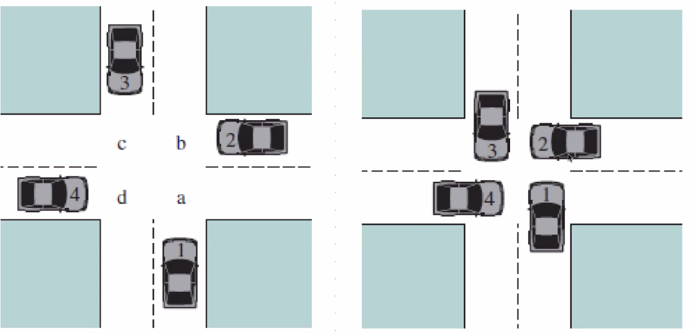


* Tipos de recursos:

* Consumibles: ejemplo un mensaje via socket, ya que una vez que se consume este no esta mas. 
* Reutilizables:  Estos recursos se pueden volver a utilizar 

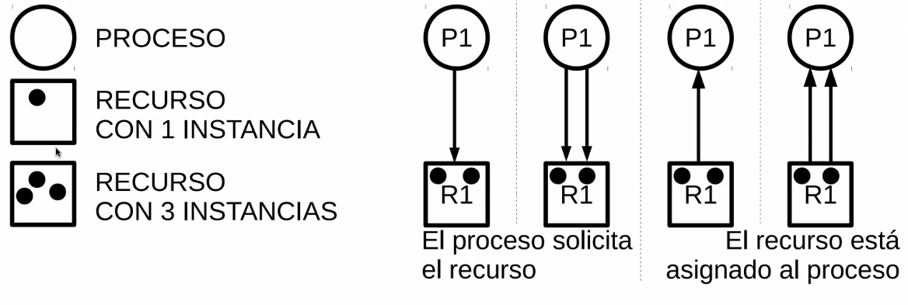

* Ciclos:
    - Si no hay ciclo no hay deadlock
    - Si hay un ciclo en el grafo puede implicar deadlock
    - Si hay un ciclo y todos los recursos son de 1 sola instancia, entonces si o si hay deadlock. 


* 4 condiciones para la existencia de deadlock
    1. Mutua exclusion = si yo tomo un recurso, nadie mas lo puede tomar
    1. Retencion y espera = En el sistema tiene que poder darse, que un proceso tenga un recurso  y este esperando por otro
    1. Sin desalojo de recursos = No puede existir la posibilidad que el sistema desaloje el recurso de un proceso. 
    `Condiciones necesarias pero no suficientes`

    1.  Espera circular 

* Tambien se necesitan minimo 2 procesos y 2 recursos. 


### Como tratar el deadlock? 

#### Prevencion
Garantiza que este no ocurrira, impediendo que ocurran alguna de las 4 condiciones suceda.
[Mutua exclusion, Retencion y espera, sin desalojo de recursos, Espera circular]

* Mutua exclcusion: Si hay recursos que no se pueden compartir no
puede evitarse. 

* Retencion y espera: Usar los recursos de a uno O pedir todos los recursos juntos. (no es muy eficiente)

* Poder desalojar recursos: 

* Espera circular: Asignar un numero de orden a los recursos. Los recursos solo pueden solicitarse en orden creciente. 

    
      
#### Evasion

Garantiza que no ocurrira, a traves de 2 tecnicas denegar el inicio de un proceso, denegar la asignacion de un recurso. Toma decisiones en tiempo de ejecucion

*  Denegar el inicio de un proceso: 
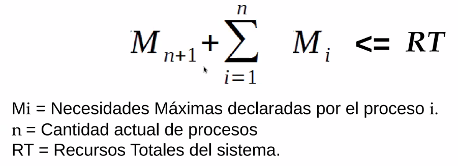

se aseguro que haya recursos para todo de modo que ningun proceso tenga que esperar nunca.
    
- Todos los procesos van a pedir todos los recursos cuando esten ejecutando. (Todos los que declararon, quizas no lo usen durante la ejecucion).


* Algoritmo de banquero (denegacion de recursos):
    - Estado seguro => No habra deadlock = Se asigna recurso al proceso
    - Estado Inseguro => Habra deadlock = No se asigna recurso al proceso (El proceso queda bloqueado)

Cada vez que el proceso pide un recurso al SO, el sistema simula que pasaria si asignara ese recurso y en que estado quedaria el sistema, ese estado hipotetico puede ser seguro o inseguro. _Mucho overhead_

* Estado del sistema:
    - Vectores de recursos totales del sistema (Fijo). 
    - Vectores de recursos disponibles del sistema (dinamico).
    - Matriz de necesidades máximas declaradas por el proceso. (Fija)
    - Matriz de recursos asignados a los procesos. (dinamica)

Necesidades pendientes= matriz de necesidades maximas - recursos asignados = necesidades pendientes. 

* Si hay una falla en la simulacion y asigna mal un recurso, no significa que si o si ocurra un deadlock, sino que existe la posibilidad de que este ocurra.

#### Deteccion y recuperacion 

* Puede ocurrir el deadlock
* No hay restricciones para asignar recursos
* Periodicamente se ejecuta el Algoritmo de deteccion para ver si hay un deadlock.

* Como recuperar el deadlock (solucionarlo):
    - Finalizar procesos involucrados
    - Intentar retroceder un procseo a un estado anterior
    - Expropiar recursos hasta que no exista el deadlock.

Algoritmo de deteccion de deadlock: sobre un estado actual te dice si existe un deadlock o no.
 
#### Avestruz
No hacer nada

* Porque cuales son las consecuencias de que ocurra? Nos importa?
* Mas eficiente, no tenes un algoritmo constante identificando o evitando algo.
* Costo del que el problema ocurra < Costo de tratarlo o evitarlo.


## Hilos y Arquitectura de Kernels

* Que es un ftp server?
FTP: File transfer protocol
* Operacion remota sobre archivos: leer, escribir, borrar, etc. (por parte de los clientes)

* Solucion 1: Un solo proceso atiende a cada cliente (muy lento e ineficiente)

`Entonces cuando un cliente se conecta con el server y realiza una operacion, el server no estara disponible hasta que este termine de atender al cliente ocasionando que no sea eficiente.`

* Solucion 2: 

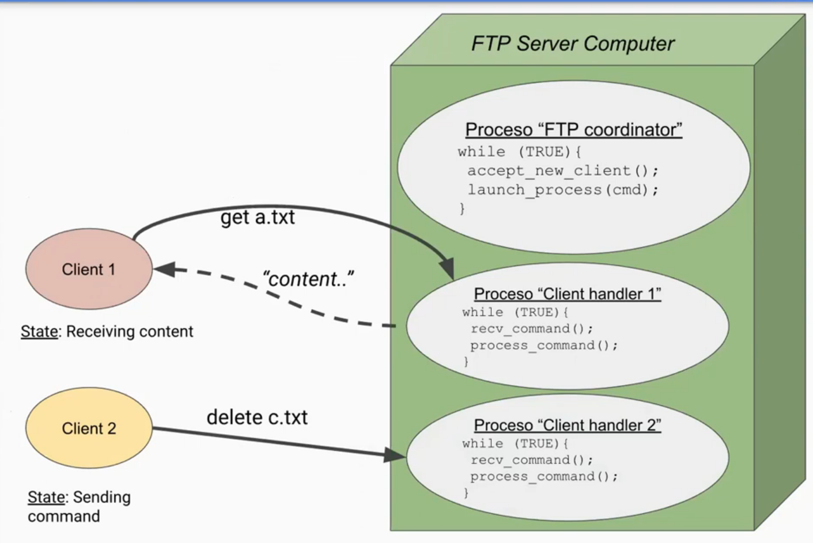

* En este caso se estaria creando un nuevo proceso por cada cliente (por parte del proceso padre _FTP coordinator_) 

* Este caso sacaria provecho de la multiprogramacion.

* Es muy robusto y si se cae una proceso el otro puede continuar funcionando tranquilamente, porque no comparte nada con el otro.

### Cuales son los pro y contras de un proceso por cada cliente?

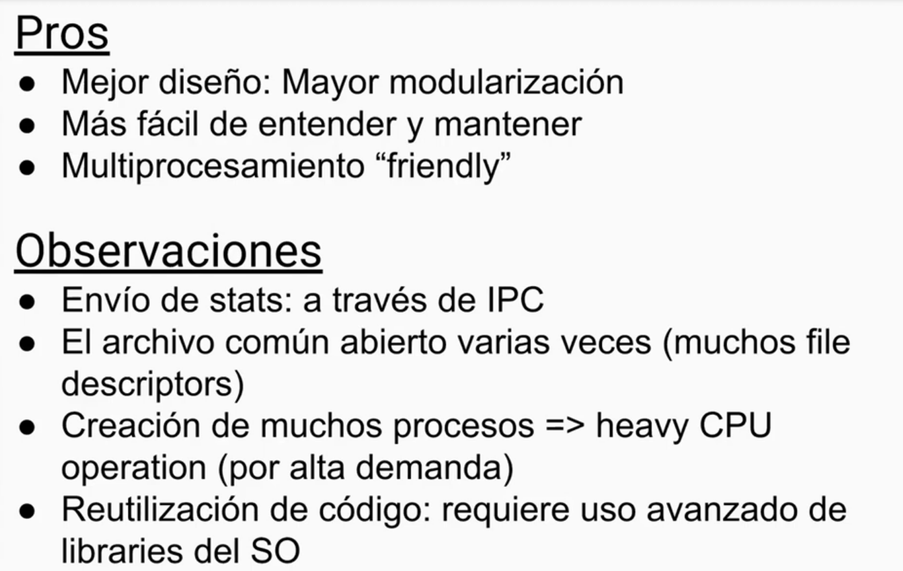


* Solucion 3: 
* Que tenemos en comun?
    * Codigo
    * Recurso en comun
    * Compartir informacion (potencial recurso en comun)

* Que podriamos hacer?
    * Compartir ese codigo
    * Compartir memoria
    * Compartir mismos archivos (recursos)
    * Tener un mismo _HILO_ de ejecucion para esos recursos.


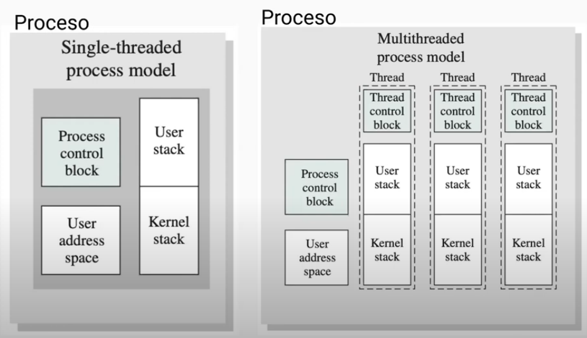


* Porque tenemos un stack duplicado por cada hilo?
Porque este stack contiene informacion o contexto que utiliza ese hilo.
esto se debe a que un hilo puede estar ejecutando una funcion 1 y por otro lado un hilo' puede estar ejecutando una funcion 2.

* A parte cada hilo tiene variables locales. 

* Cada hilo tiene su propio contexto de ejecucion y este va guardado en el thread control block . 

* Aun asi hay cosas que todavia se guardan en el PCB tales como: procces id, PPID, lista de recursos asignados al proceso, etc. _Tambien puede que haya punteros al Thread Control Block_


* Que va en el user addres space?
    * El heap del proceso
    * Datos estaticos (variables globales)
    * Funcion main con todas las funciones (codigo del proceso)

* La funcion que ejecuta el hilo no  tiene idea de las estructuras que este contiene.


#### Algunas definiciones

* Multithreading: Habilidad de un SO de soportar multiples (y concurrentes) hilos de ejecucion.

* Thread/Hilo:  Unidad de trabajo que puede ser planificada por el SO o biblioteca, la cual involucra un estado de ejecucion, contexto y una pila a nivel usuario/sistema


### Ventajas y desventajas de estos hilos:

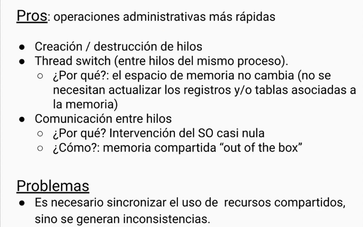

* Un hilo puede crear a otro hilo
* La creacion de un hilo es mucho mas rapida que un procesador

Cuando hay muchos hilos para estos los datos y las variables son la mismas para todos. (Es decir comparten esta informacion)

* Los procesos ya por default arrancan con un hilo si o si, luego este puede crear mas si lo desea/necesita.


### Tipos de hilos

#### KLT: Kernel level Threads (Para poder crear este hilo, es a traves de una syscall)
- Son administrados por el kernel
- Planificacion a corto plazo (_la realiza el SO_)
- Los planificadores de corto plazo modifica los hilos y no el proceso: Hilo Ready-> Running
    
* Pros y contras:
    - Dos o mas hilos pueden ejecutar en procesadores diferentes
    - Si un hilo se bloquea, el otro puede seguir ejecutando (_el SO los distingue y los reconoce_)
* Contra: Mayor overhead, porque son administrador por el SO y requieren cambios de modo.

#### ULT: User level Threads
* Administrador por biblioteca (corre en el espacio de usuario)
* Doble planificacion: Nivel hilo, nivel SO. (_Cada una puede tener su propio algoritmo_)


* Pros: 
    - Minimo overhead: no involucra cambio de modo en la administracion
    - Planificacion: propia de la biblioteca
    - Portabilidad

* Contras:
    - Si un hilo se bloquea (*Obviamente a traves de una syscall al SO*), se bloquean los demas hilos, porque el SO no los reconoce ni los diferencia. (entiende como que si la syscall de bloqueo es del proceso completo y no de un unico hilo).
    - Los hilos no pueden ejecutar en procesadores diferentes (NO multiprocesamiento)

#### Syscalls en los ULTS

* Cuando se quiere realizar una syscall en estos hilos, no se hace una syscall directamente desde el codigo, sino que se utilizan WRAPPERS  (_Funciones intermediarias provistas por la biblioteca que luego_), que luego con un par de cositas realiza esta syscall pedida.

`Ejemplo: en lugar de read() -> user_threads_read()`


* Esto seria interceptar las syscalls: es decir al utilizar wrappers estas syscalls pasan si o si por la biblioteca y asi pueden saber cuando puede llegar a ser una syscall bloqueante

* Jacketing: Tecnica que consiste en convertir las syscalls bloqueantes en no bloqueantes (_asi logrando que si una syscall era bloqueante no lo sea y asi no bloquee todos los demas hilos_)
    - El bloque de un hilo no implicaria el bloqueo de los demas hilos.
    - La biblioteca intercepta todas las syscalls   


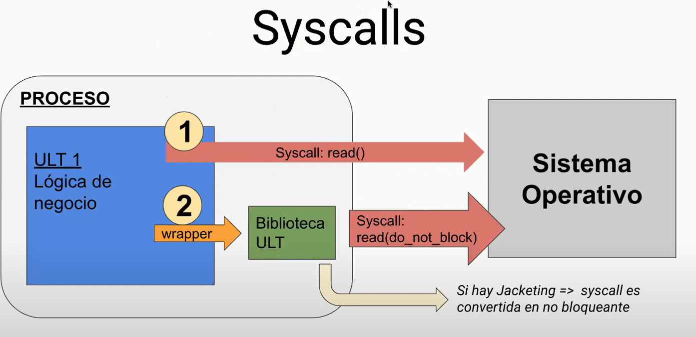

* Como funciona esta biblioteca ULT entonces? Al ser la intermediaria entre el ULT y el SO, en caso de que la syscall que realice el ult derive en un bloqueo del hilo, no lo realizara _debido a que la syscall es no bloqueante_ y esta biblioteca se encargara sola por si misma de _simular_ un bloqueo y darle paso a otro hilo que ejecute


### KLT y ULT combinados

Intentar aprovechar los beneficios de ambas estrategias:
- Aprovecar multiprocesamiento de los KLTS
- Aprovechar bajo overhead de los ULTS
 
`Ejemplo: Tareas CPU bound (mucho uso de cpu) => KLT: Cpu y muchos ULTs`

`Ejemplo 2: Tareas I/O bound (mucha entrada salida-> mucho tiempo bloqueado) => KLTS: I/O`
  
* Imagen de ejemplo de ULTs puro y KLTs puros: 

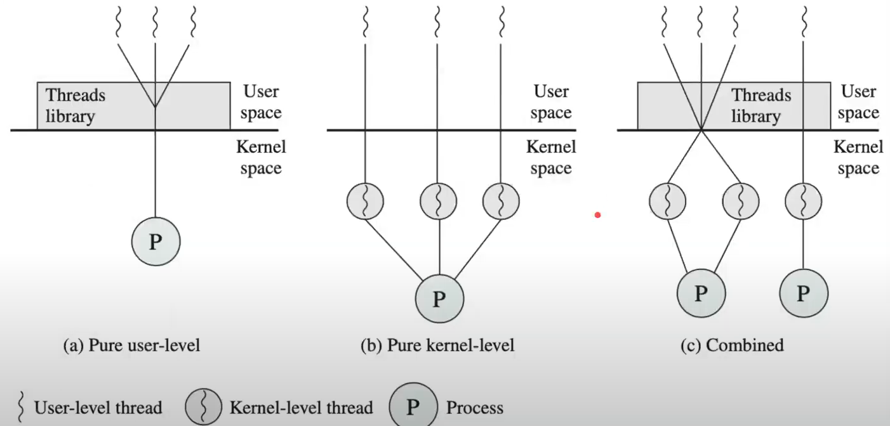

* Finalizar un proceso => Mueren todos los hilos dentros de ese proceso.


### Arquitecturas de kernels

* Monolitich kernel:
 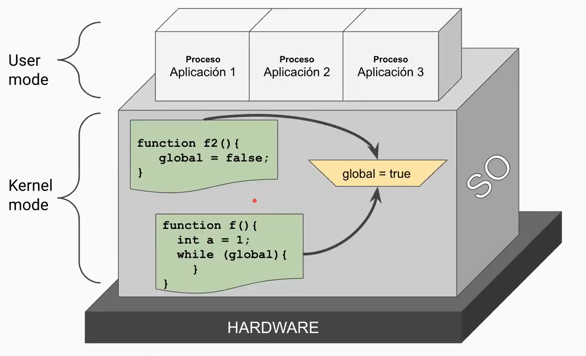
 * "Modulado" con funciones pero es un bodoque con todo el codigo ahi, una mezcla terrible.
 

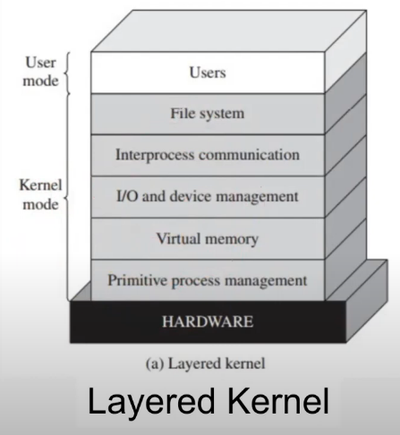
* Layered kernel: Donde se modularizan las funciones y cada capa solo puede hablar con la que tiene abajo.
    - Puede ocasionar que una cagada en una capa afecte a todas

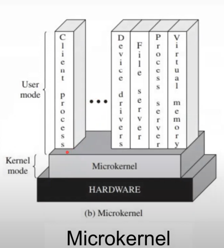
* Micro kernel: solo una parte muy pequena en medio kernel
    - EL resto de las logicas que le pertenecerian al modo kernel, lanzo minis procesos que se encarguen de eso
    - Al ser miniprocesos y estar aislados, el fallo de uno no implica que afecte a los demas 
    - Estos procesos solo se comunican con syscalls (_entonces mucho overhead etx etc_).

## Concurrencia

### Soluciones de software
* Espera activa
    - Desventajas: busy waiting (esta todo el dia esperando la ocurrencia de un evento y preguntando todod el tiempo overhead) // usa el cpu (recursos), preguntando pelotudeces.
    - Puede quedar esperando de por vida a la espera de algo que nunca va a ocurrir.

* espera activa: Tecnica en la cual un proceso/hilo evalua repetidamente si uan condicion es cumplida o no, ocupando el procesador durante todo ese intervalo/

* Livelock: situacion en donde 2 o mas procesos cambian continuanmente sus estados en respuesta a cambios en otro/s proceso/s, sin hacer ningun trabajo util mientras tanto.v 


Soluciones con mutua exclusion garantizada:
* Algoritmo dekker
* Algoritmo de peterson.

### Soluciones de hardware

* Deshabilitar las interrupciones // las deshabilito hago lo q tenga que hacer en la parte critica y la vuelvo a activar
    - que pasa si el proceso las deshabilita y despues se olvida de habilitarlas? lindo quilombo

* Compare and swap: es una instruccion en particular (provista por los procesadores).
    - Es una instruccion atomica: se ejecuta o no se ejecuta, no se puede interruptir porq es una instruccion unica.

* Atomic increment: aumenta un contador en uno (de manera consistente)

### Solucion de SO

* Semaforo: variable entera que solo puede ser accedida mediante wait() signal(). _mas las que se usan para inicializar etc_

* Las operaciones wait , signal : se asumen como atomicas (ocurren o no ocorruen), no se interrumpen.

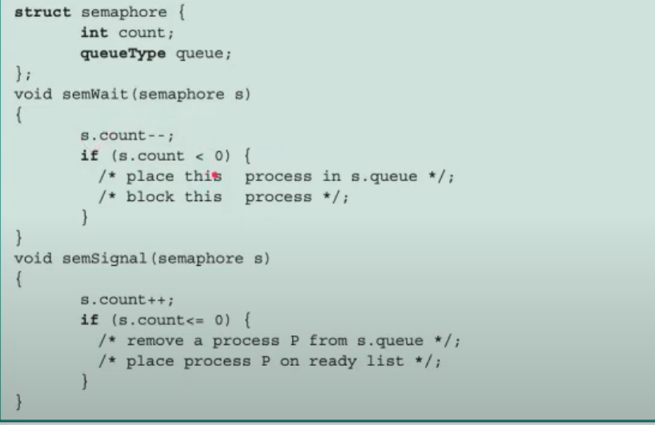

`Basicamente si el valor es negativo tras decrementar, se bloquea el proceso y lo envia a la cola. `

` Al enviar signal si es 0 o negativo, remueve un proceso P de la cola y pone el proceso P en ready. `

* Se inicia en 0 o valores positivos.
* La cola indica la lista de procesos que estan esperando en ese semaforo

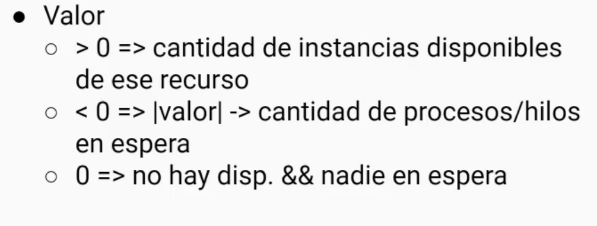


# Segundo PARCIAL
## Memoria Virtual


* Para ejecutar un proceso debe estar completo en la memoria principal en forma de proceso

* RAM
    * Conjunto de direcciones lineales
    * Vector de gran tamano
    * Administrador por el SO
    * La ram no conoce su contenido

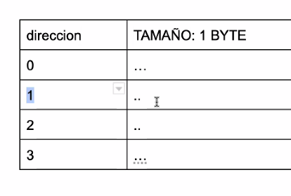

### Requisitos / Funcionalidades

1. Reubiacion: es necesario poder reubicar los programas/datos de una parte de la memoria a otra parte

1. Proteccion: nigun proceso podria leer/escribir en cachos de memoria de otro proceso con el que no comparte nada.

1. Comparticion: puede ser algo tal como compartir una variable entre 2 procesos (mediante una syscall), o bibliotecas de codigo.

1. Organizacion fisica/logica: 


* Al ser las asignacions de memoria dinamicas, nunca podremos saber a que direcciones de memoria va a acceder un proceso antes de ejecutarlo,
eso se conoce solo en tiempo de compilacion.

### Sistema registro BASE+Limit

Es el hardware el encargado de hacer la validacion si la referencia que quiere hacer un proceso es valida es decir:

* Pero luego es el SO es el que decide lo que pasa, si esta validacion es invalida.

`Base <= Direccion <= Base + limit `

* Esta base + limit se guarda en los registros del procesador.


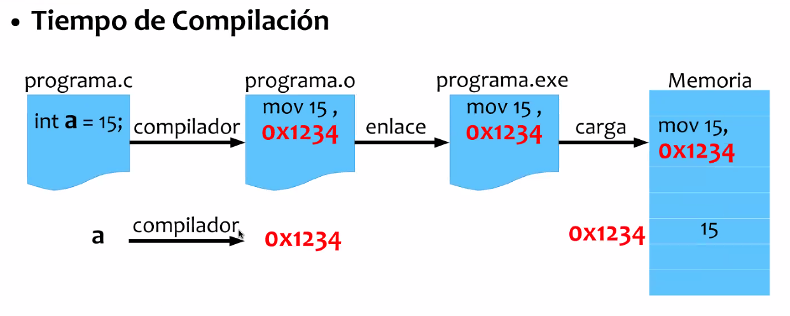

* Estas asignaciones en tiempo de compilacion implicaria el no poder reubicarlo y tambien el no poder elegir donde cargarlo.

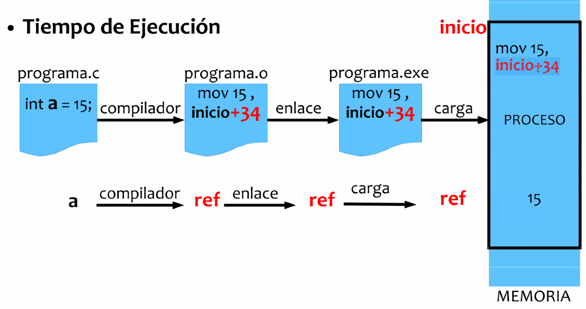

* En este caso es en tiempo de ejecucion:
    * Se realiza la traduccion de la direccion en el momento que se va a ejecutar dicha instruccion
    * Esta traduccion la realiza la MMU (_memory managment unit_) 
    * Direccion logica + Base (INICIO) = Direccion real 

`La direccion esta de BASE/INICIO, es guardada en el PCB del procesador, porque cada uno va arrancar y terminar en un lugar distinto`

`Tambien se va a dejar esta base en los registros del procesador`


* Direccion logica: Referencia a una ubicacion de memoria utilizada por el procesador, son independientes de la ubicacion real en memoria _puede ser traducida a una direccion fisica_

* Direccion Relativa: Un tipo de direccion logica, expresada en base a un punto conocido

* Direccion absoluta/fisica: es una referencia que no necesita ninguna traduccion para acceder, es la direccion posta y punto. 


### Enlaces 

COmo pego la biblioteca al proceso para utilizar las funciones de esta?

* Enlace estatico: todas las funciones se pegan al programa original (gran bodoque). _impide que varios programas la puedan usar_. Deben pegarla cada programa por su cuenta a su codigo.

* Enlace dinamico: implica que la biblioteca este preinstalada ya en el sistema. 


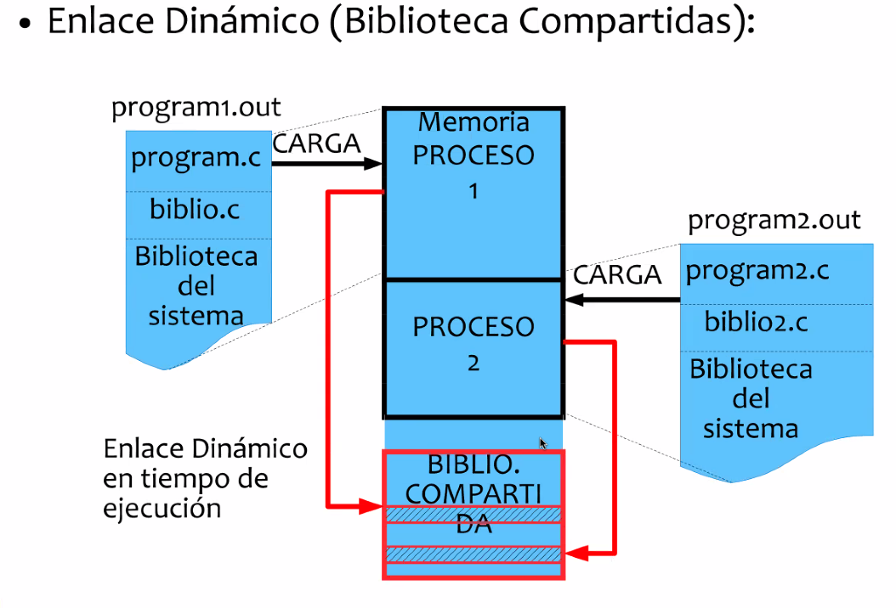

### Asignacion de memoria para procesos

#### Particionamiento fijo

* En que consiste?

1. Se divide la memoria en tamanios fijos
1.  El proceso se ubica en alguna particion del mismo o menor tamanio 
1. Existen dos formas: hacer todas las particiones iguales o hacer un par grandes otras mas chiquitas y asi..

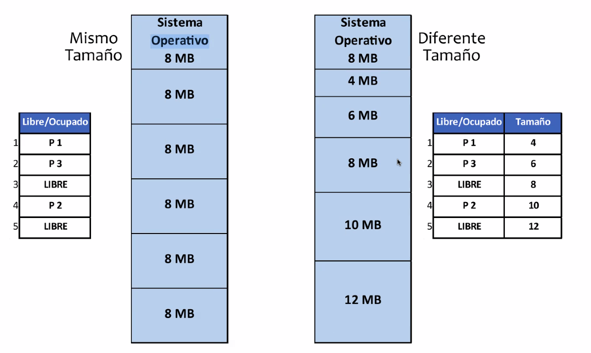


* Implicancias: 
    * Fragmentacion interna: se derrocha memoria ya que un proceso de 4mb x ejemplo se le asigna una particion de 10mb, hay 6mb de derroche.


#### Particionamiento dinamico

* Creo la particion del tamanio que necesita el proceso: no hay fragmentacion interna

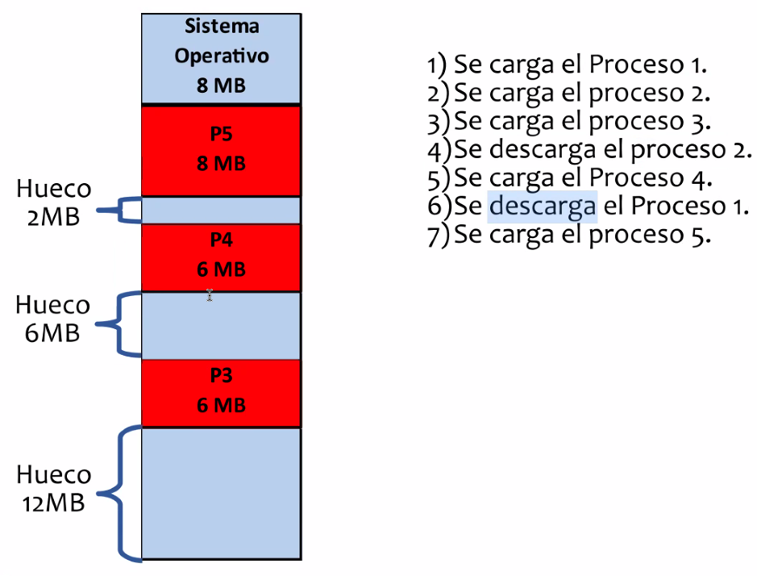


* Sufre de fragmentacion externa: un monton de espacios pero no estan continuos entonces no pueden ser aprovechados.

Para esto existen algoritmos para solucionarlos entre ellos:

1. Primer ajuste: Busca el primer hueco desde el comienzo de memoria
1. Segundo ajuste: Busca el primer hueco disponible desde la ultima asignacion
1. Mejor ajuste: busca el hueco mas chico donde puede entrar el proceso
1. Peor ajuste: busca el hueco mas grande donde pueda entrar el proceso 

* El de peor ajuste tiende menos a sufrir fragmentacion externa, porque como usa espacios grandes hay mayor espacios remanentes y se podrian ubicar otros procesos.


* Compactacion: consiste en juntar todos los huecos para formar un solo gran hueco grande. 

### Budy system
* Compensa desventajas y ventajas del fijo y dinamico.

* Se asigna a los procesos tamanios de memorias que son potencia de 2^n

* asdasd RELLENAR


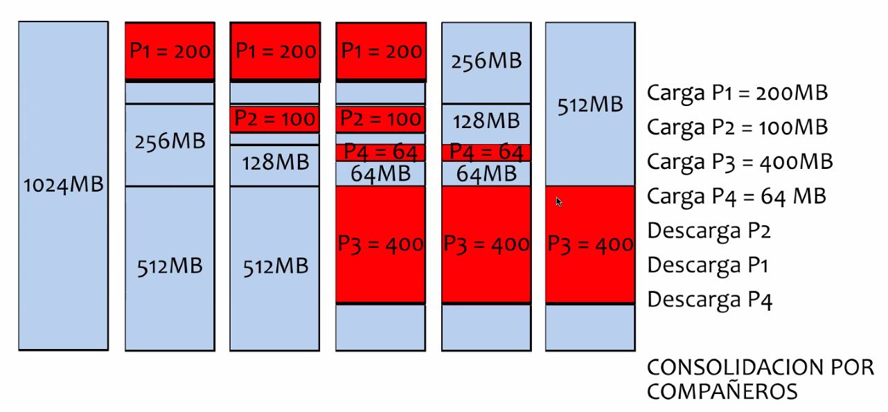

### Segmentacion

* El proceso no necesita estar contiguo en memoria

* El proceso se divide en segmentos, de tamanio variable (`Son grandes y pocos`)

* Cada segmento representaria una parte del proceso _desde la vision del programador_
    * Codigo
    * Pila
    * Datos
    * Biblioteca
    * Heap

* Se necesita tabla de segmentacion: tabla donde dice donde esta cada segmento del proceso

` Direccion logica: N de segmento | Desplazamiento `

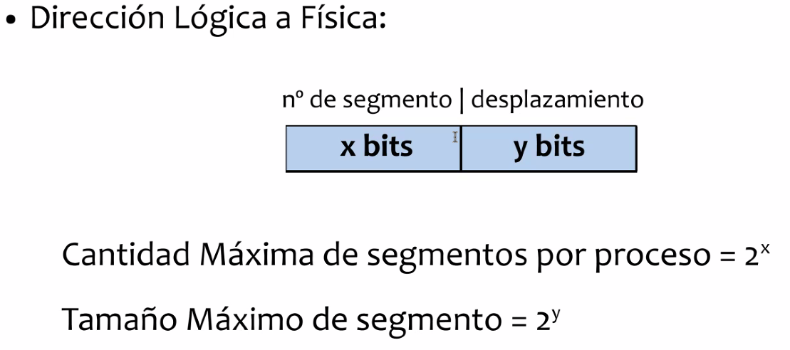

* Proteccion: cada segmento puede tener permisos de lecutra, escritura y ejecuccion.


### Paginacion

* EL proceso no necesita estar contiguo en memoria
* Los procesos y la memoria se dividen en partes del mismo tamanio (`Son chiquitos y muchos`)
* Se dividen en paginas los procesos
* La memoria se divide en frames 

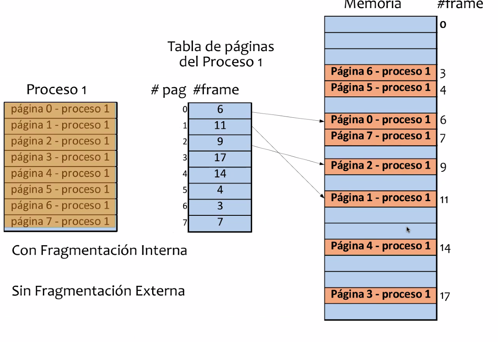

* Frames: son las formas en la que se divide la memoria
* Para cada proceso es necesario una tabla de paginas.

`Direccion logica: N pagina | Desplazamiento `

`Direcicon fisica= N frame | Desplazamiento`

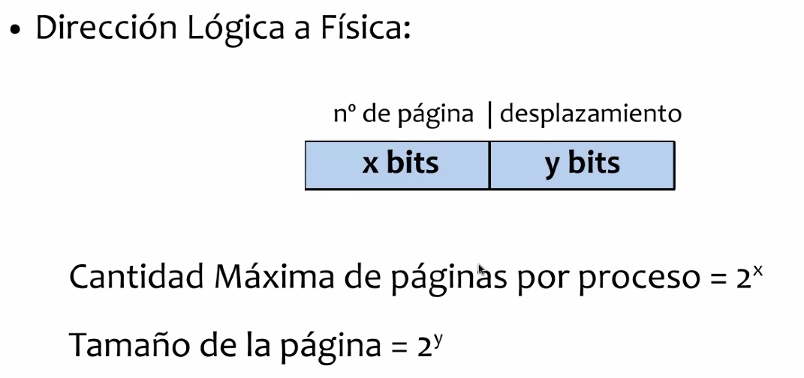

(Pagina * tamano de pagina) + Desplazamiento 

* Proteccion: cada pagina se le puede indicar una proteccion (ejecucion, lectura, etc)

* Implica mas facil compartir memoria, dos procesos desde su tabla de paginas pueden apuntar al mismo frame de la memoria ram.

* Tabla de frames libres: Estructura que indica que frames de memorias estan libres.
[100101001010101]


### Segmentacion paginada

* Combina ambos

* Agarra el proceso lo divido en segmentos y cada segmento lo divido en paginas 

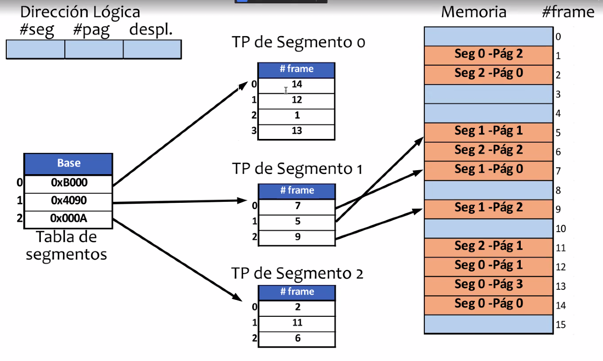


Direccion logica= `SEG| PAG| DESPLAZAMIENTO`

* La traduccion de la direccion se hace de manera colaborativa entre el hardware y el sistema operativo.

 
## Memoria virtual

* Que es lo que motiva el uso de memoria virtual?
    * No siempre se usan todas las partes del proceso durante su ejecucion
    * espacio reservado sin usar

`* El hecho de optimizar el uso de recursos`

* Que permite la memoria virtual? (En el disco)
    * Traducir direccion
    * Dividir el proceso en partes (segmentos o paginas)
    * Solo ir cargando las paginas que se necesitan en el momento a memoria real.
    * Aumentar el grado de multiporgramacion _a causa de que se pueden cargar mas procesos_

_el proceso no tiene idea si sus paginas estan o no cargadas_

_la estrategia de memoria virtual viene incorporada por hardware ya_

### Mecanismo de busqueda de paginas


1. Primero se debe validar la presencia de la pagina en la memoria
    * La pagina siempre va a tener un bit (actualizado constantemente) que nos indica si esta o no cargado en la ram.
1. Interrupcion por fallo de pagina
    * Se bloquea el proceso a la espera de que la pagina este disponible
    * El sistema operativo se encarga de traer la pagina a la ram.
1. Solicitud de pagina
    * Se determina en que frame se va a ubicar la pagina faltante
    * se solicita la pagina (E/S)
1. Se carga la pagina en memoria y manda una interrupcion al SO
1. SO atiende interrupcion
    * actualiza tabla de paginas (_cambia bit de presencia_)
    * Debloquea el proceso
1. Se vuelve a ejecutar la instruccion que produzco el page fault.

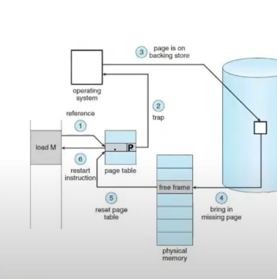

* Cuando el dato se encuentra en ram, son 2 accesos a memoria 1 para la tabla de paginas y otro para la ram
* Cuando la pagina no esta cargada es un acceso a disco.

* Como traigo una pagina si esta toda la ram ocupada con otras paginas?
    - Piso una pagina que ya esta en ram, pero si esta ya esta modificada se guarda el estado de esta pagina y 
    se manda a memoria virtual con el estado actualizado y luego depues si puedo pisar la pagina.

### Principio de proximidad o localidad

* Permite que la memoria virtual funcione y no genere bajo  rendimiento
* Durante un Tiempo se usan unas paginas de forma activa. Este conjunto se denomina localidad.


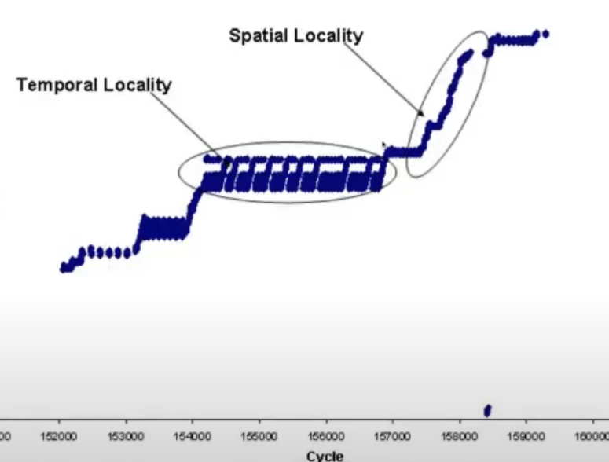

* Principio de localidad: durante este tiempo se utiliza un determinado numero de paginas y se reduce el page fault.
* Localidad espacial: se precargan paginas que se considera que el proceso va a usar asumiendo un riesgo.

### Estructuras de tablas de paginas

`Paginacion jerarquica`

* Se parten las tablas de pagina y se cargan solo las que se necesitan
* Existe un puntero a tablas de paginas donde se apuntan a estas particiones de la tabla

`Tabla de paginas invertida`

* Hay una tabla para todos los procesos
* Se cambia la forma en la que se indexa: ahora se sabe para cada frame que pagina guarde.

### Tlb: buffer de traduccion anticipada

* Soporte de HW
* Mejorar traducciones de direcciones
* Puede reducir la cantidad de accesos a memoria.

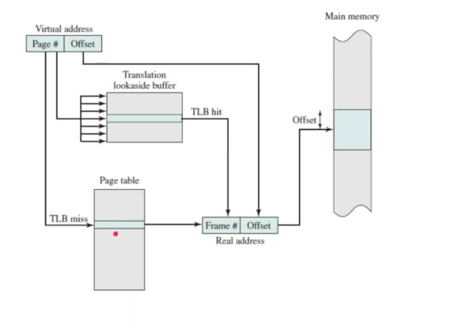

* Muy rapida pero con pocas entradas
* Se puede hacer una tabla en la cache con los PID para saber a que proceso pertenece cada pagina.

### Diseno del sistema operativo

* Trashing: cuando en un intervalo de tiempo se pasa mas tiempo trayendo y sacando paginas que ejecutando el proceso en si.

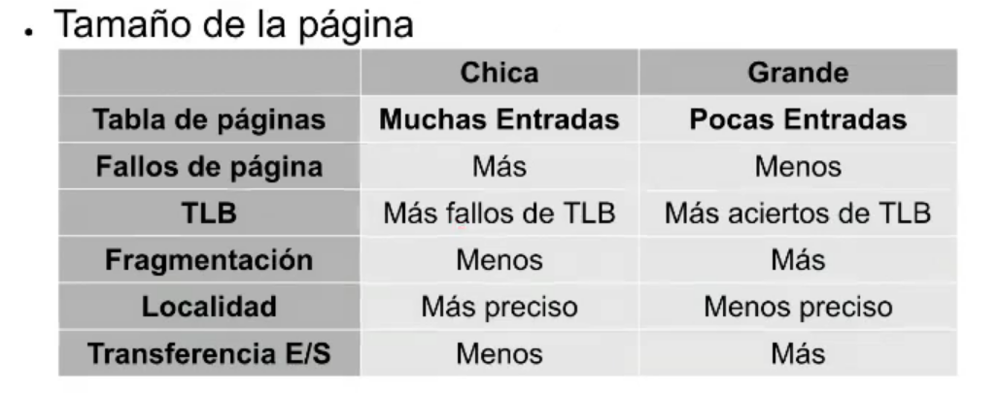

### Algoritmos

####  reemplazo o sustitucion

* Algoritmo optimo
    * Se elige a la pagina que se realizara una referencia en el futuro mas lejano.

* Algoritmo FIFO
    * Se elige a la pagina que hace mas tiempo esta en memoria
* Algoritmo LRU
    * Se elige a la pagina que hace mas tiempo no es referenciada

* Algoritmo de reloj
    * Se va recorriendo en forma de reloj al proximo marco a reemplazar pero:
        * Se mira si se uso recientemente (bit de uso=1) -> no se reemplaza y pasa al siguiente marco
        * Se mira si no se uso recientemente (bit de uso=0) ->se reemplaza

* Algortimo tabla de paginas FIFO
    * no requiere un formato diferente.
    * Actualizar puntero a la proxima instruccion que sera reemplazada

* Algoritmo tabla de paginas LRU
    * Por cada pagina se necesita almacenar el momento de su ultima referencia

* Algoritimo tabla de paginas CLOCK
    * Necesita agregar un bit de uso a la tabla de pagina

* Algoritmo de clock mejorado
    * Necesita: Bit de uso, bit de modificado, puntero al siguiente marco a analizar
* Preferencia de como busca la pagina:
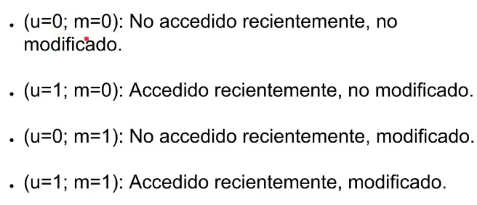

1. Si no encuentra la primera opcion en la primera vuelta
1. va con la 2da opcion y da la 2da vuelta _modificando el bit de uso a 0_.
1. Vuelve a dar otra vuelta en busca de la 1ra opcion
1. Da la vuelta en busca de la 2da opcion


 


## File system

* Objetivos:
    * Almacenar datos y operar con ellos
    * Soporte para varios usuarios. Implica proteccion
    * minimizar la posibilidad de perdida de datos.
    * Maximizar el desempeno del sistema
        * SO: administrar espacio en disco y aprovecharlo
        * Usuario: Tiempo de respuesta
    * Soporte para distintos positivos
    * Garantizar integridad o coherencia de datos.

```
Atributos de un archivo:
    - Nombre
    - Tamanio
    - Identifiacador
    - Permisos
    - Tipo
    - Fechas
    - Ubicacion
    - Propietario
```
* Para acceder a un archivo se da la direccion completa 
`EJ: /home/utnso/documents/archivo.txt`

* Archivo: conjunto de datos asociados, etiquetados con un nombre, opcionalmente persitidos en una almacenamiento secundario

### Operaciones

* Basicas: Crear, abrir, leer, borrar, cerrar, escribir, reposicionar, truncar, renombrar (mover). 

#### Apertura de archivos:
    * Modo apertura
    * Tabla global de archivos abiertos (una entrada por cada archivo abierto)
    * Tabla de archivos abiertos por proceso (Una entrada por cada archivo que abrio el proceso)
    Esta apuntada por el PCB


* Tabla global:
    - File.txt
        - FileControlBlock (atributos)
        - Aperturas (cantidad)
        - 

* Tabla de archivos por proceso
    - Proceso 1
        - File 1.txt
            - Puntero:4
            - Modo: lectura
        - File 2.txt
    
#### Cerrojos/locks:
herramientos de tipo "semaforo" provistas por el SO para operar sobre archivos.

* Garantizan que cuando un proceso este escribiendo o lo que sea sobre un archivo, no lo pueda hacer otro al mismo tiempo.

* Tipos:
    - Exclusivo: 1 proceso a la vez
    - Shared: N proceso a la vez
    

* Obligatorio: [COPIAR]
* Sugerido:

#### Tipos de archivo

* Distinguidos por el SO
    - Regular
    - Directorio
    - Acesos directos
    - 
* Distinguidos por las aplicaciones: Archivos regulares 
    - Imagen
    - pdf
    - .docx
    - .txt

#### Metodos de acceso

* Acceso secuencial
* Acceso directo

#### Ruta de un archivo

* Ruta absoluta: /home/utnso/documents/lele.txt
* Ruta relativa: lele.txt, se completa con el working directory

#### Puntos de montaje

* Lugar donde se ubica el archivo F:/ , C:/ asdasd

#### Proteccion

* Acceso total
* Acceso restringido: 

```
Permisos
-Propietario: RWX (read write execute)
- Grupo: RW-
- Resto: R--
```

### Sistema de archivos
* Disco logico:
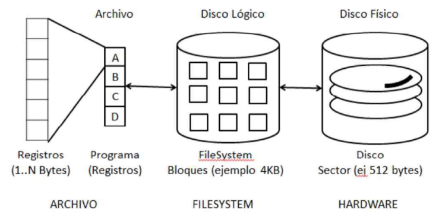

`Si escribo  un registro de 8KB => Estoy esciribendo 2 bloques de 4KB => 16 sectores de 512bytes`

* En que consiste formatearlo? basicamente darle un formato (_FAT32, NTFS, EXT2, etc_)
- Escribir la informacion necesaria en una particion para poder operar con archivos en base
a una especificacion determinada 

### Estructuras de un file system

1. Bloque de arranque o Booteo (MBR): Tabla de particiones
1. Bloque de control de volumen: La informacion sobre las particiones
1. Meta informacion: atributos, nombres, etc
1. Informacion: los archivos en si

* FBC: File control block

* Tabla de montaje

* Estructura de directorios
* Tabla/lista global de archivos abiertos
* Tabla/lista de archivos abiertos por proceso.


* Directorios: es un tipo de archivo, indices de nombres.
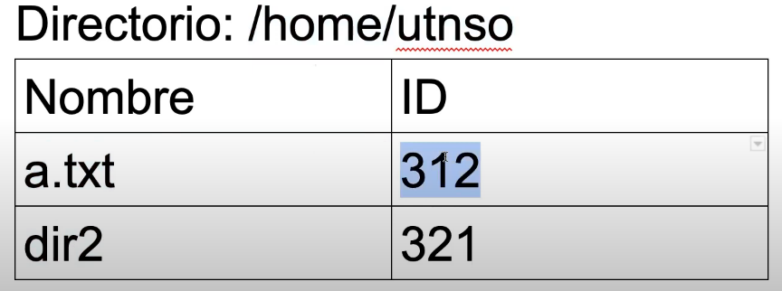

- Inode: Information NODE es el ID del archivo. 

### Metodos de asignacion
* EL filesystem lo que va a hacer es asignarle bloques a un archivo, asi es como se le asgina sue espacio.

* Para poder abrir un archivo se para en un directorio y con el ID, recorre ese directorio hasta encontrar el archivo (o sea el FCB). Esta estructura sirve para controlar el archivo, la levanto a memoria y desde ahi tengo puntero a los datos.  `Es decir: punteros a los blockes asignados a lso archivos`

* Todos los esquemas sufren de fragmentacion interna, porque los bloques son fijos y a todos los archivos se le asignan N cantidad de bloques
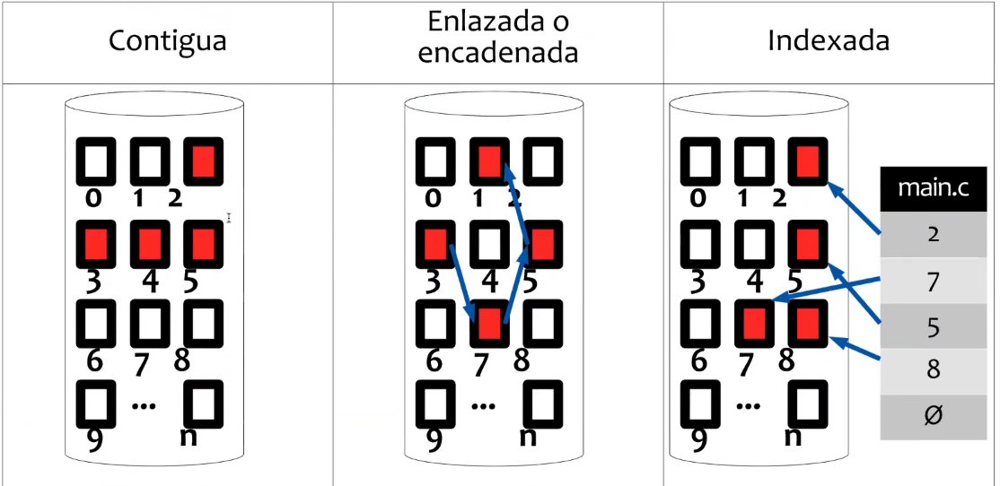
#### Mecanismo contiguo

* Se indica el bloque inicial y la cantidad de bloques
`Ejemplo: Main.c | Bloque inicial: 2 | Cant bloques:5 `
- El archivo Main.C tendria asignado los bloques : 2,3,4,5,6.

* Ocupa poco espacio en disco
* Sufre de fragmentacion externa
* Si se corrompe un sector del archivo, se pueden leer los otros.

#### Mecanismo enlazado
* Se elige cualquier bloque pero cada bloque apunta al bloque siguiente asigando
`Archivo Main.c| Bloque inicial: 3 | Bloque final: 1`
- Se lee el primer bloque y desde ahi se van averiguando los otros

* En caso de que se corrompa uno de los bloques, no podes seguir reconstruyendo el archivo, ya que este bloque contiene el puntero al proximo y perderias la informacion.
#### Mecanismo indexado
* En el FCB se tiene un puntero por cada bloque del archivo

`Ejemplo: Main.c |3|5|6|4|`
* estan en orden, el primer bloque seria el 3, el 2do el 5 y asi ...

* Si se corrompe un sector del archivo, se pueden leer los otros.

### Gestion de espacio libre

* Listas de bloques libres
    - listas de porciones libres

* Bitmap = [10100100010101010] (libre/ocupado) 1 ocupado 0 libre

* indexada `FREE|32|43|54|63|12`

* Agrupamiento en bloques

### Ejemplo de escritura de un archivo nuevo
1. Crea archivo
    - Verificar que exista FCB disponibe
    - Crear entrada de directorio

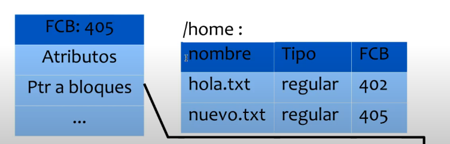

1. Asignarle bloques requeridos:
    - Abrir el archivo y agregarlo en lista de archivos abiertos 
    - obtener bloques libres (recorro la estrucutra para conocer cuales estan libres y la reescribo)
    - asignar bloques: en los punteros a bloques del FCB pongo los bloques asignados.
1. Escribir en el archivo
    - Escribir bloques
    - Actualizar atributos: fecha, nombre, permisos, etc.
1. cerar archivo:
    - elimino de la lista de archivos abiertos

### Recuperacion
- Comprobacion de coherencia
- Backups
- Journaling (estructura de registro)

### Swaping
* Es una particion del disco dnd se van a guardar los procesos suspendidos.
* Tmb se pueden guardar las paginas de los procesos

### FAT: File allocation Table

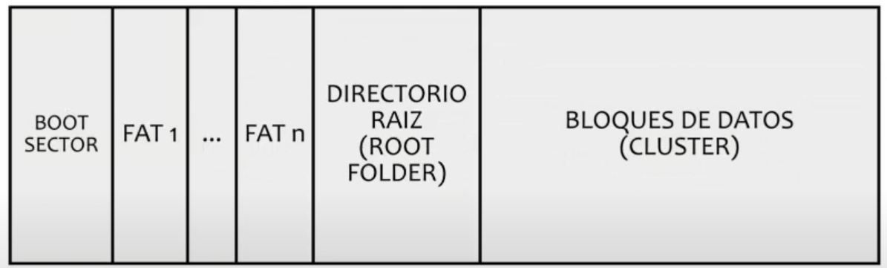

* Se dedican 1 o N regiones a la tabla FAT (estructura administrativa)

* Cluster: donde van los bloques de datos, son archivos, directorios, lo que sea

* FAT: 
- Directorios: contiene un listado de archivos y directorios

Entradas del directorio:

 `|TIPO DE ARCHIVO| NOMBRE Y EXTENSION | PRIMER CLUSTER DEL ARCHIVO * | TAMANIO | ... |`

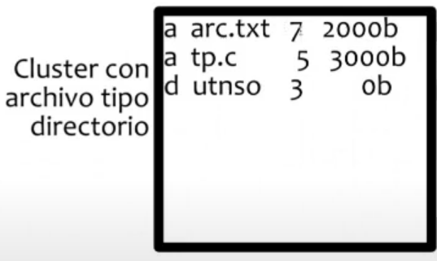

* FAT: Consiste en una tabla que contiene punteros a bloques 

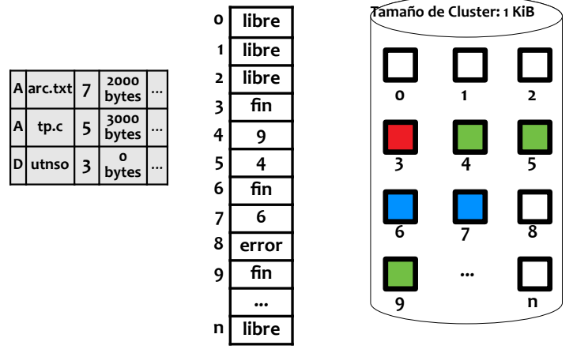

ejemplo: si busco el archivo arc.txt, se va al primer cluster 7 indicado en el directorio, luego
en la tabla de entrada FAT se busca en la posicion 7 a que bloque se apunta -> apunta al bloque 6 , leemos el bloque 6 y buscamos en la tabla FAT a que bloque apunta -> FIN. no hay mas datos para leer. 

* Basicamente la tabla fat, indica cual es el bloque de dato que le sigue a cada bloque

_la cantidad de entradas de la tabla fat == cantidad de bloques en el disco_

- FAT12= punteros de 12 bits
- FAT16= punteros de 16 bits
- FAT32= punteros de 32 bits (_solo se usan 28 bits para el puntero_)

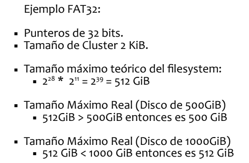


### EXT2 | EXT3 | UTS

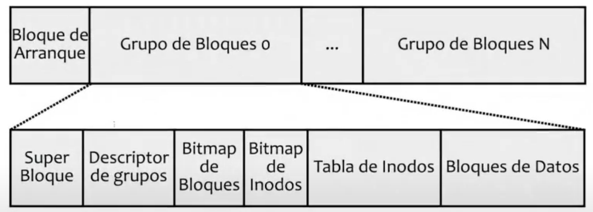

* El volumen se divide en grupos
1. Super bloque: administra informacion general de volumen (cantidad total de bloques del volumen, bloques libres, direccion del primer directorio)
1. Descriptor de grupos: administracion generla de todos los grupos
1. Bitman de bloques: array de bits [10101] indica los bloques libres
1. bitmap de inodos: array de bits [11001] indica si las estructuras de inodos estan libres
1. tabla de Inodos (File control block): array con todos los inodos que hay en el grupo de 
bloques
1. bloque de datos: los datos en si.


* Directorios:
`NUMERO DE INODO | NOMBRE ARCHIVO | TIPO ARCHIVO`
* hay un puntero al inodo, que es el que nos permite luego administrar el archivo, ya que este contiene los punteros a los bloques del mismo.

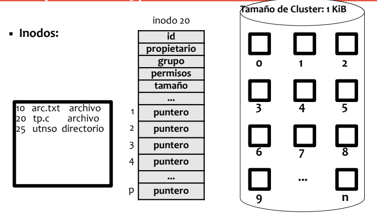

* los inodos:
    - Uno por archivo
    - Tamanio fijo: 128 bytes
    - Contienen atributos del archivoi
    - Punteros a los bloques de datos
    - representa el FCB
 
* Inodos: Permiten crear punteros a demanda (normalmente solo tiene 12, osea nada!

* Tipos de punteros del inodo: 
    - Directos: apuntan a bloque de datos
    - Indirectos: Apuntan a un bloque de punteros
        - Simples
        - Dobles
        - Triples

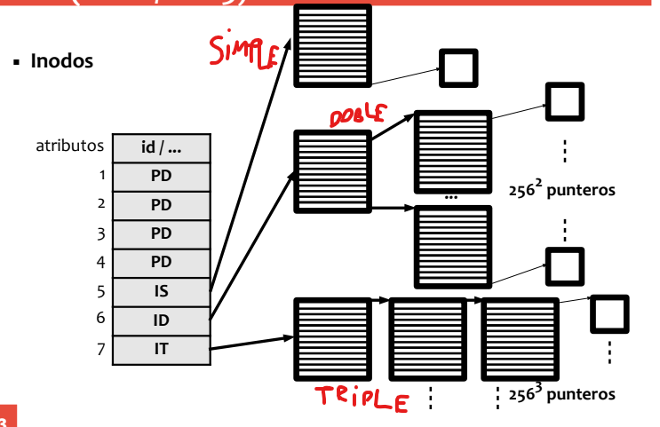

* estos tienen un limite igual, no se pueden expander infinitamente.

* Soft link: 
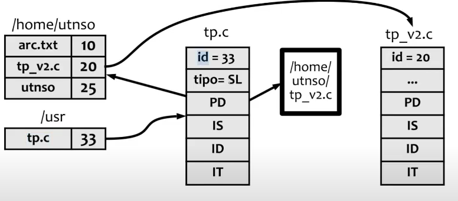

1. Se intenta crear un archivo directo del archivo tp_v2.c en el directorio /usr
1. Se crea el archivo tp.c y junto con el un inodo 33
1. el inodo en el puntero a bloque de datos contiene la direccion real del archivo tp_v2.c
1. Se accede con la direccion absoluta _/home/utnso/tp-v2.c_
1. se abren a los datos apuntado por esa direcion, el inodo 20

* Hard link:

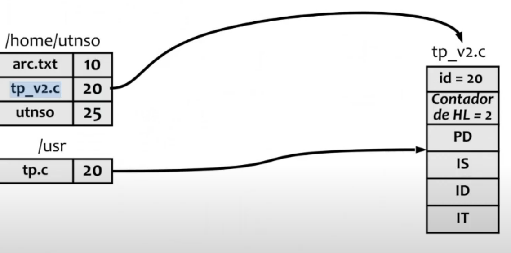

* EL contador de HL: indica la cantidad de direcotrios q estan apuntando a ese archivo
* EN caso de que se borre el archivo original, sigue funcionando el acceso directo.

### Comparacion entre FAT y UFS
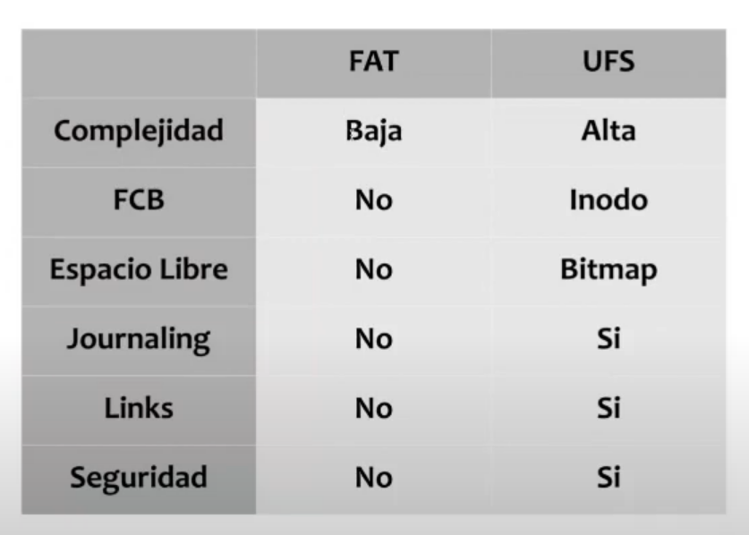\


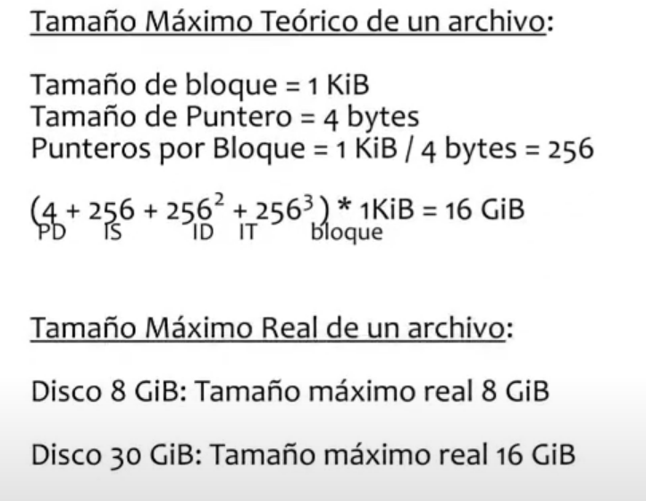

