# Analisis de sistemas

## Planificacion
* Que es la planificacion?

Proyectar un futuro deseado, previendo las acciones de ejecucion futura y determinando los medios para conseguirlo

* Objetivo SMART

S= (_Specific_) Especifico, definir con claridad que como cuando y donde

M= (_measurable_) determinar de forma cuantificada los resultados o beneficios esperados. _No puedes gestionar lo que no puedes medir_ 

A= (_Achievable_) debe ser posible y razonable, teniendo en cuenta los recursos y capacidades disponibles para ejecutar el plan

R= (_Realistic_) tener en cuenta los factores culturales, legales, politicos, etc. que sea algo realista y no un bolazo

T= (_Time bound_) establecer una duracion optima del proyecto.


* Que es el control?

Momento especifico en el cual se analiza la situacion actual de la ejecucion del plan y se la compaara con la situacion teorica prevista.
- Se busca:
    - detectar desvios
    - Cumplimiento de subobjetivos

* Ante un cambio de objetivo se debe crear un nuevo plan.

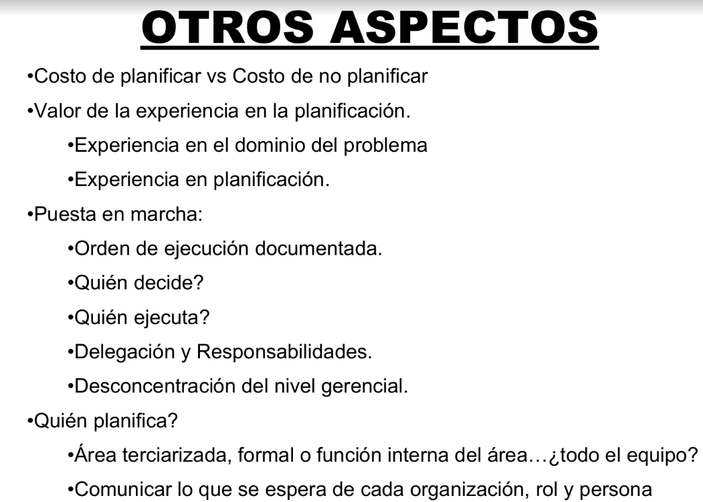


* Proyecto: Conjunto de actividades que permiten lograr un objetivo, con recursos limitados en un tiempo dado

* Planear: se suele usar para terminos de largo plazo, estrategias de nivel directivo, un marco de referencia sin fechas estrictas.


### Valorizacion:
* Estimcion de costo variable:
    - Costo de HW y SW:
        - Adquisicion
        - Alquiler
        - Mantenimiento
    - Viajes, gestion del proyecto,etc.
* Margen de ganancia
* Reparticion del costo fijo
* Esfuerzo en hs hombre por rol con su costo unitario
* Oportunidad de mercado.
* Nivel de incertidumbre
* Codigo fuente
* Relacion comercial
* Condicion de pago
* entre otras ...

### Tipos de plan de desarrollo de SW

* Basada en plan:
    - Permite identificar riesgos, restriciones, recursos, etc de forma temprana
    - Facilita coordinacion
    - Intenta anticipar la incertidumbre
* Agil:
    - Se realiza una estimacion rapida para asignar recursos
    - No anticipa la incertidumbre
    - Prefiere retrasar la decision a tener que revisar deciciones tomadas tempranamente.
    - Muchas decisiones se posponen y se toman segun se requieran durante el proceso de desarrollo

### Triangulo de hierro 

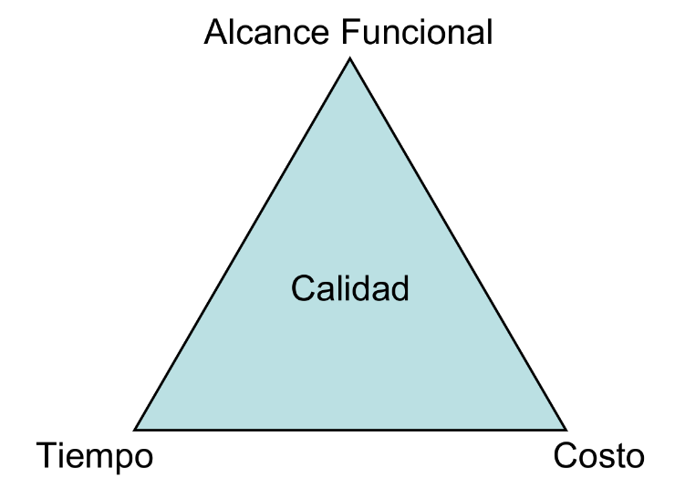


## Planificacion GANTT

* Se debe tener en cuenta:
    - Sabados,domingos, feriados.
    - Cierres del mes
    - Temporada alta, media, baja.
    - Horarios (proyecto internacional), feriados INT.
    - entre otras variables.


* Puntos de control:

    - Puntos _del calendario_ donde se valora el avance
    - Reporte breve que resuma el trabajo realizado/ para comparar con lo esperado.
    - Alcance del desvio: tarea, grupo, proyecto.
    - Es necesario renegociar/cancelar el plan?

* Tareas: 
    - Codigo
    - descripcion
    - recursos 
    - barra de avance 
    - dependencia
    - resultado esperado.
    - Esfuerzo (dias/hombres) vs duracion (dias)

* Dependencias:
    - Tipos:
    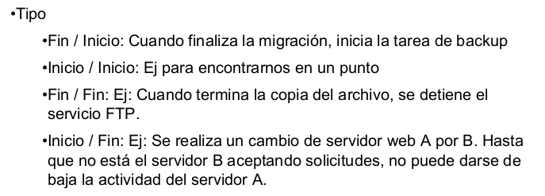
    - Motivo: Por naturaleza, por restriccion de recursos.
 
_Puede que no se grafiquen en el gantt_

## CPM y Pert 

### En que consisten?

```
- Tecnicas de planificacion basada en duracion de tareas.
- El avance del tiempo se presenta en forma relativa al inicio del proyecto (fecha 0)
- No se presentan fechas o unidades de tiempo absolutas
- Diagrama de red
- Las dependencias se identifican a trasves de la ubicacion de tareas

```

### Pert 
* Es una tecnica de planificacion probabilistica, la variable del tiempo es calculada a traves de una formula: 

`[Duracion optimista+ 4x Duracion normal + Duracion pesimista]/6`

### CPM

**Crithical path method**

* Los nodos representan el inicio y fin de una tarea 
* Tareas ficticias: representa la dependencia entre tareas pero que no consume ni tiempo ni costos. (_Se representa con la letra Y, con un subindice_)
* No se pueden identificar el uso de los recursos con este metodo.
* Fechas tempranas => Sumo desde el nodo inicial hasta el nodo final de izq a derecha, en caso de 2 llegadas siempre tomo la de mayor valor.
* Fechas tardias => Resto desde el nodo final de derecha a izquierda, en caso de 2 llegadas tomo la de menor valor.
* Siempre el nodo inicial queda 0 | 0 y en el final siempre queda N | N
* Margen total (de una tarea )= Fecha fin tardia - Duracion - F inicio temprana.
Este margen total nos indica el tiempo de holgura de una tarea, es decir cuanto tiempo podes retrasarte en dicha tarea.
* Tarea critica= Margen total=0 y entre 2 nodos criticos.
* Si existe una tarea con margen total=0, si o si aparece en un camino critico
* Intervalo de flotamiento (De un nodo): Fecha tardia-Fecha temparana 
* Nodo critico= Intervalo flotamiento= 0
* Camino critico (_Siempre uno al menos hay_): Se habla de tareas, es el camino por el cual ninguna tarea puede retrasarse.
* El minimo de margen total de las tareas no criticas, nos indica el maximo tiempo que podemos recortar/adelantar un proyecto.

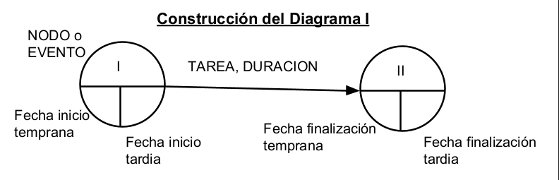


## Estudio preliminar

* Conocer a la organizacion: estructura formal, area, ambito, etc.

* Obtener del usuario su vision de la problematica de la organizacion.

Esta etapa puede omitirse si:
1. Soy interno a la org
1. Se ha realizado un estudio preliminar recientemente.

_Puede utilizarse un estudio preliminar realizado por otra org de sistemas, para facilitarnos el proceso (siempre sin contaminar nuestra vision de la org)_

* Determinar las areas a relevar
* Ver las expectativas del cliente con el proyecto
* Realizar una estimacion global para asignar recursos (mas o menos aproximada)

* Que es el sponsor? es una persona del area directiva que tiene como rol defender el proyecto ante la alta gerencia y tambien a los subordinados. (es el referente del proyecto)
* Product owner: la persona encargada de maximizar el valor del producto, es decir que sea util para la organizacion.

* Definir y explicar metodologia y ciclo de vida a utilizar.

* Asignar recursos al proyecto.

``` Estrucutra del informe:
- Introduccion
- Desarrollo : Informacion, probelmas, estructura formal, participantes de la org, etc.
- Cierre: Anexos, conclusion
```

#### Objetivo de mandato
- Posibles problemáticas:
    - Reducción de costos
    - Mayor exactitud y consistencia en la información
    - Mayor velocidad en el proceso
    - Mayor velocidad en consulta de la información
    - Mayor seguridad
    - Integración de las áreas de negocios

* Alcance: saber a que area de la org va a alcanzar la solucion
Alcance funcional: que funciones y cuales no va a realizar
* Areas involucradas
* Restricciones de tiempo y presupuesto
* Contactos roles y responsabilidades

#### Investigacion de documentos:
- Balance contable
- Estatuto
- Estudio de mercado
- Organigrama
- Manual de misiones y funciones
- Informes anteriores de estudio preliminar.

#### Aspectos a tener en cuenta
- Estimacion nivel 0:
    - Nos pueden solicitar una estimacion de tiempos y costos
    - La estimacion es una referencia, pero es _No vinculante_ 
    - Es una estimacion de esfuerzo y no de presupuesto.

- Costo del estudio preliminar:
    - Lo asume la SW factory
    - Se cobra al cliente?

## Tecnicas de relevamiento:
- Observacion personal
- Entrevista
- Investigacion de documentos
- Cuestionario
- Medicion de tiempos:

#### Observacion personal:

Es obtenida a partir de un interlocuras a traves de la simple visualizacion de la vida interna de la org.

Tipos: Activa | Pasiva.

* Utilidad (_Permite observar o detallar_):
    - Distribucion del espacio
    - Horarios
    - Modalidad de trabajo
    - Centros de poder informales
    - Procedimientos informales
    - Actitud de la gente con poder.

* Ventaja: da una informacion que se puede obtener de esta unica manera y no esta interferida por interpretaciones ajenas.
* Desventaja: Es subjetiva, debe ser contrastada con otras tecnicas

#### Entrevista

Permite obtener datos, informacion, opiniones sobre un det. proceso de la org.

* Se debe planificar:
    - Objetivos
    - Seleccionar entrevistados
    - Fecha lugar y hora.
* Tipos de preguntas: Abierta | Cerrada | Sondeo.

* Esquema:
    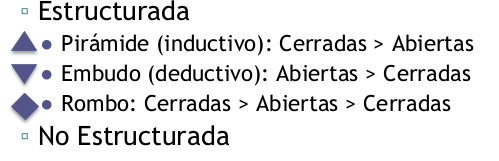
    * Presentacion, Desarrollo, Conclusion.
* Documentar: minuta de entrevista.


### Investigacion de documentos
* Documentos a revisar/analizar:
    - Estatuto, balance, estudio de mercado.
    - Organigrama
    - Manual de procedimiento,cursogramas.
    - Documentacion de SW.
    - Formularios y/o comprobantes.
    - Base de datos
    - Plantillas reportes.
    - Notas
    - Etiquetas de prodcutos bienes.
* Se deben verificar la vigencia de los documentos
* Verificar validez entre los mismos y contrastar con las otras tecnicas.

## Tecnicas de redaccion de informes
- Informe tecnico / No tecnico Escrito
- Informe tecnico / No tecnico Oral.

#### Informe tecnico escrito
* Se utiliza para los hitos de fin de etapa planificados segun la metodologia

* Se conforma por un doc estructurado:
    - Caratula
    - Versionado
    - Indice
    - Objetivo 
    - ALcance
    - Desarollo
    - Conclusiones
    - Anexo
    - Glosario
    - entre otras.

#### Informe no tecnico escrito
* Contenido:
    - Origen
    - Destinatario
    - Fecha
    - Asunto
    - Desarrollo


* Tipos:
    - Nota
    - Memo
    - Circular.

#### Informe tecnico oral
El mismo se conforma/ realiza con:

1. Motivo
1. Expositor
1. Exposicion
1. Recursos [_Material para tomar apuntes, folleto con resumen_]
1. Vocabulario.
1. Audencia
1. Lugar

* Estrucutra del informe:
    - Duracion:
        - Presentacion (_Organizacion, expositores, proyecto, tema_)
        - Desarrollo en etapas
        - Break.
    - Cierre
    - Evaluacion (_Feedback_)


## Relevamiento

* Objetivo:
    - Obtener informacion detallada sobre la problematica
    - Enfocarse en areas afectadas
    - Recolectar informacion necesaria para especificar requisitos (_necesario a posteriori para estudio factibilidad y analisis_)

* Busca automizar un proceso o mejorarlo?
#### Roles

* Roles de la organizacion:
    - Sponsor: es quien defiende el proyecto dentro de la organizacion. 
    - Product Owner: el duenio/ responde por el proyecto
    - StakeHolder: El accionista de la empresa basicamente

* Segun el nivel a relevar: Directivo, gerencial, operativo.

#### Procesos

1. Porque?
1. Que?
1. Quien?
1. Cuando?
1. Cuanto?
1. Como?
1. entre otras...

- Solicitar ejemplos

#### Informe 
* Tipos:
    - Material crudo
    - Repositorio
    - Informe estructurado
* Debe ser ratificado por el cliente.

#### Estrategias
* Por area o proceso.
* Contexto de proceso relevados: sin contexto, contexto real, contexto imaginario
* Selectivo o no selectivo?
* Como organizar los requerimientos relevados?

#### Relevamiento de metodologias agiles

!! COMPLETAR

## Estudio de factibilidad

Consiste en  “Presentar un documento formal al usuario/cliente con
las diferentes alternativas de solución posibles para
solucionar el problema de información de la
organización que aseguren el éxito del proyecto,
incluyendo la recomendación de la alternativa que
consideramos óptima.”

#### Alcance
- identificiar alternativas de solucion al problema de SI
- Detallar requisitos, restricicones y alcance de cada alternativa
- Realizar analisis TEO: tecnico, economico y operativo x cada alt.
- Realizar analisis comparativo de las alts. segun TEO.
- Mencionar al ciliente la alternativa que consideramos optima.

#### A tener en cuenta
- El analisis debe ser sistematico objetivo y transparente
- muchas org necesitan min. 2 alternativas.
- Otras aplicaciones:
    - Entitdaes publicas: ganar una licitacion
    - Decision de alternativas: reutilizar un componente de terceros?
- Alternativas deben ser mutuamente excluyentes

#### Restricciones del proyecto

- Costos:
    - ROI: Retorno sobre la inversion
    - TRI: tiempo de retorno de la inversion (_periodo de repago o paybacj_).
    - TIR: Tasa interna de retorno
- Tiempos: plazo, fecha inicio/fin, duracion.
- Tecnicas: lenguajes, plataforma, compatibilidad hw/sw.

#### Identificacion de las alternativas

- Codigo y nombre
- Descripcion
- Plataforma
- Restricciones: presupuesto, roi, tri.
- Duracion
- Alcance funcional : que contempla y que no

### Analisis TEO
```
Se analiza en forma independiente cada alternativa para ver si pasan estas verificaciones, [tecnica, economica, opertaiva]. En caso 
de que no pasen alguna se descarta. Caso contrario indica que esta alternativa cumpliria con el obj del proyecto.

```


#### Tecnico
* Es posible de implementar?
* Factores exogenos:
    - Recursos tecnologicos _restricciones externas_
    - Escalabilidad
    - Legal
    - Infraesctructura
    - Impacto ambiental
    - Covid 19
#### Economico
* Es conveniente implementar?
* Factores economicos/ financieros:
    - Recursos tecnologicos _restricciones de presupuesto_
    - Costo total
    - Inversion del cliente
    - Estimacion de utilidad anual deseada
    - TRI aceptable por cliente
#### Operativo
* Es viable?
* Factores endogenos:
    - Recursos tecnologicos _restricciones internas_
    - Capacitacion
    - Disponibilidad de recursos
    - Cultura, costumbres, intereses.
    - Adaptabilidad al cambio

### Comparacion de alternativas
* Permite valorar objetivamente cada alternativa
* Identificar variables de comparacion: Rango de valores, % de ponderacion, importancia para el proyecto.
* Asignar valor a cada alternativa para cada variable.
* Asignar puntaje a cada alternativa

Algunas posibles variables de comparacion:
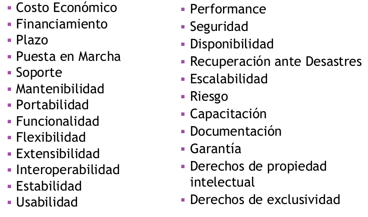

## Ingenieria de requisitos

Conjunto de actividades que intentan entender las necesidades de los usuarios y traducirlas en afirmaciones precisas
y no ambiguas, que se usaran en en el desarrollo del sistema.

* Es el proceso de descubrir, analizar, documentar y verificar los servicioes y restriccioens que conforman los requisitos del sistema.
* Una manera sistematica de llegar de las necesidades usuarios => especificacion.


### Requerimiento vs requisito
* Requerimiento (Request) del Usuario:
“Conjunto de percepciones externas para que el objeto
sea considerado como lo que es”
- Enunciados en lenguaje natural (o incluso diagramas)
acerca de los servicios esperados por el usuario, y
restricciones sobre las cuales desea que opere

* Requisito (Requirement) del Sistema:

“Características inherentes a un objeto para ser
considerado como tal”

- Descripciones de lo que el sistema debe hacer: el servicio que debe proporcionar,las restricciones de su operación.

#### Documento de especificacion de requisitos
* Objetivo: definir con precision el sistema que se implementara
* Sirve como contrato entre comprador y desarrolladores.

#### Fuentes del requisito
* Quien lo solicita?
    - Cliente
    - usuario
    - Equipo de desarrollo
    - El dominio (contexto, org, proceso en si)

* porque es necesario construir requisitos?:
    - Puede existir contradicciones entre si
    - Puede que no sean realmente necesarios
    - 
#### Construccion del requisito
* Lo realiza el ing en requisuitos.
* Omnipresencia (todo sistema tiene requisitos, independientemente si se anuncia o no.)

- Requisitos explicitios: Se documentan y formalizan
- Requisitos implicitos: solo existen en la mente de los desarrolladores.

### Clasificacion de requisitos:

* Funcional: “Enunciados acerca del servicio que el
sistema debería proveer, cómo debería reaccionar ante
entradas particulares, y cómo debería comportarse
ante situaciones específicas. Incluso pueden indicar lo
que NO debe hacer el sistema”

* No funcional: “Representa características o
restricciones sobre, el sistema en sí, o sobre
determinados servicios o funciones que ofrece”

* Obligatorio / Opcional
* Interrelacion: puede generar/restringir otros requisitos

#### Algunos ejemplos requisitos no funcionales

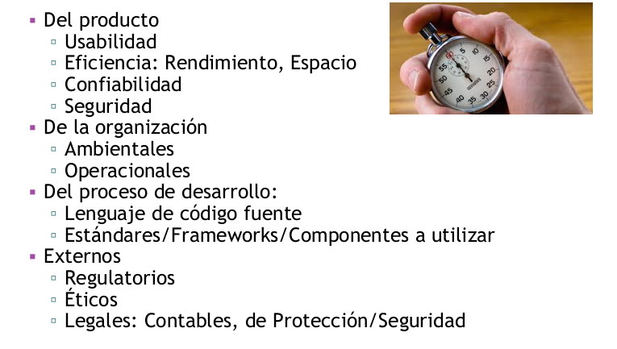

### Caracteristicas del requisito
1. Atomico
1. Completo.
1. Consistente
1. Correcto
1. Conciso
1. Factible
1. No ambiguo

#### Como especificar un requisito?
- Casos de uso
- Modelos graficos
- Pesudocodigo
- Hablado asi nomas
- Metodologias agiles: User stories/ Story Tests
- Especificaciones matematicas.

#### Proceso de Ingenieria de requisitos
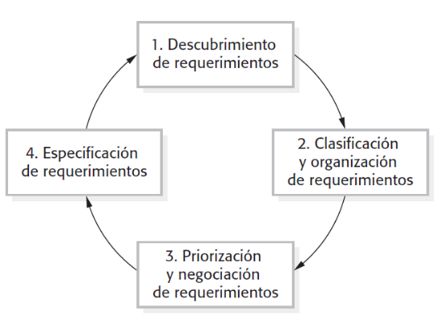

#### Validacion de requisitos
* Validacion: ¿Estamos construyendo el producto correcto?

* Tecnicas de validacion de requisitos:
    - Uso de prototipos
    - Diseno de casoas de prueba
    - Revision de requisitos

#### Verificacion de requisitios
* Verificacion: ¿Estamos construyendo el producto correctamente?

* Tecnicas de verificacion:
    - Inspeccion codigo fuente
    - Prueba de SW
    - Depuracion de SW

### Gestion de requisitos

* Administrar cambios en los requisitos:
    - Identificar problema
    - Analizar problema y el cambio en su especificacion
    - Estimar el impacto y costo del cambio
    - Implementar cambio
    - Revision de requisitos
   
* Trazabilidad del requisito:
    - de origen: Vinculo con stakeholder que lo solicito
    - de requisito: precedencias y dependencias entre requisitos
    - de disenio: vinculo con modelos de disenio y componentes que los implementan.

## Tablas de decision
* Decision: proceso de evaluar distintas alternativas o cursos de accione y seleccionar una de ellas por medio del analisis

* Tipos: programadas | No programadas.
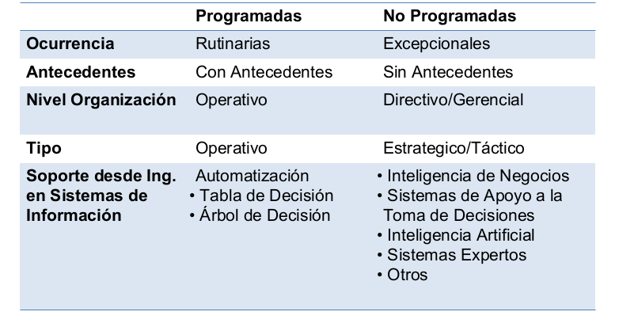

* Tabla de decision:
Técnica de modelado para la representación y
documentación de las decisiones
programadas, permitiendo:

- Reducir ambigüedad de la decisión
- Validar distintas fuentes de relevamiento
- Identificar aspectos no relevados
- Automatizar la toma de decisión
- Comunicar decisiones complejas

* Sirve para presentar procesos logico relevados -> requerimintos del sistema.

### Determinacion de cantidad de reglas
Binaria: 2^N (cantidad de condiciones)

## Ciclos de vida:
Definiciones:

* Ciclo de Vida  “Los ciclos de vida son los estados intermedios que atraviesa
un objeto/elemento desde que nace hasta que muere”

* Ciclo de Vida de Software: “Todo proyecto SW tiene un ciclo de vida asociado, que
indica los estados intermedios por los que ha de transitar
un producto o artefacto (documentaciones, minutas,
contratos, SW ejecutable, etc) desde que nace hasta que
muere”

* Define los estados de los artefractos involucrados en el desarollo del SW, y cada estado se define por las actividades que realiza. 
* Una vez que se completan todas las actividades deun estado, se realiza la transicion al estado siguiente
* Mapa de Actividades: Permite visualizar la relación entre cada estado y las actividades que le corresponden

`Ningun ciclo de vida es mejor que otro, solo tienen ventajas/desventajas con respescto a :`
1. Velocidad desarrollo
1. Calidad prodcuto
1. Manejo de riesgos
1. respuesta a cambios
1. costo

### Tipos de clico de vidas
#### Ciclos de vida iterativos
* Existen diferentes instancias de uno o mas estados. Pueden ser repetidas por un mismo equipo o ejecutadas de forma paralela e independiente por distintos equipos.

* Al comienzo del proyecto  se conoce cuántas iteraciones
se realizarán

#### Ciclos de vida incrementales
* Caso particular de Ciclo de Vida Iterativo, que define diversas entregas del producto que agregan cada vez más valor productivo al Software

* El software puede utilizarse desde la primer entrega

#### Ciclos de vida evolutivos
* A medida que avanza el proyecto se van definiendo las
nuevas iteraciones a realizarse que incrementarán el valor
del producto

* Al comienzo del proyecto no se conoce cuántas iteraciones
se realizarán

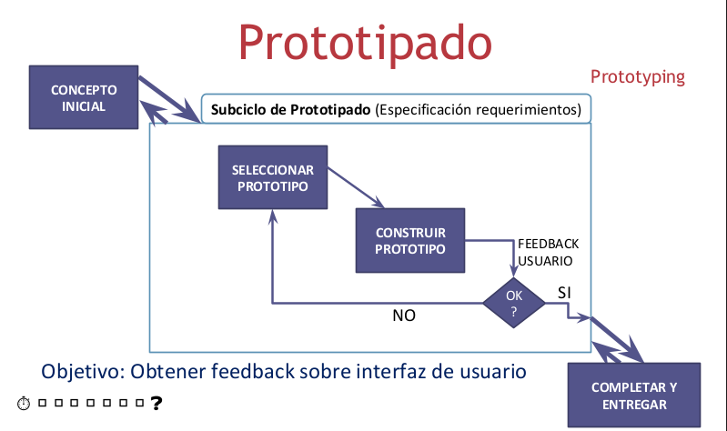

#### Prototipados
* Evolutivo: cuando se considera aceptable se refina y se reentrega como prodcuto terminado
* Desechable: cuando el prototipo se considera aceptable se destruye,  y se realiza un producto nuevo utilizando el conocimiento obtenido por la intereaccion del usuario con el prototipo

#### Entregas evolutivas 

* Se genera una primer versión siguiendo ciclo de vida Prototipado, buscando feedback sobre alcance funcional

* A medida que se itera, se evalúa si:
    - Buscar más feedback sobre alcance funcional (enfoque evolutivo)
    - Avanzar en lo solicitado hasta el momento (enfoque entregas incrementales)
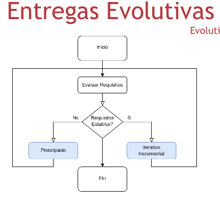


#### Espiral
* Orientado a riesgos
* Cada ciclo es una cascada que agrega valor sobre el producto
* Luego de cada ciclo se evalua antes de iniciar el siguente:
    - CUal es el riesgo de realizarlo?
    - CUal es el beneficio potencial de realizarlo?

#### Administracion del riesgo
* Elementos que componen al riesgo:
    - Probabilidad de ocurrencia
    - Impacto en caso de ocurrir
    - Exposicion= probabilidad X impacto
* Planes para minimizar riesgo:
    - Mitigacion: disminuir exposicion _proactivo_
    - Contingencias: acciones a realizar si ocurre _reactivo_
* estrategias: Evitar, transferir, mitigar, aceptar.

### Modelos de proceso

#### Proceso unificado (Orientado a objetos)
* NO es un Ciclo de Vida, sino un “Modelo de Proceso”, ya
que además de las estados del ciclo de vida define
actividades, prácticas, herramientas, modelos, roles, etc

* Sirve únicamente para proyectos que sigan el enfoque Orientado a Objetos

* Dirigida por “Casos de Uso”

* Las fases representan un “cascada puro”: I>E>C>T

* Dentro de cada fase hay un ciclo de vida evolutivo

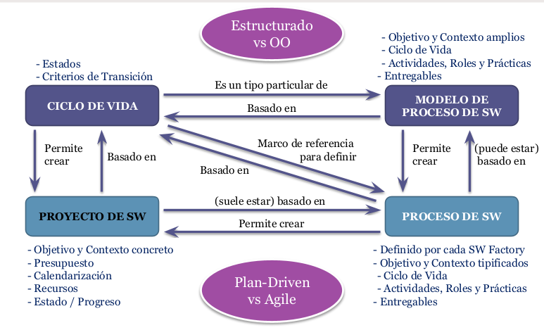

#### Comparativa entre distintos tipos
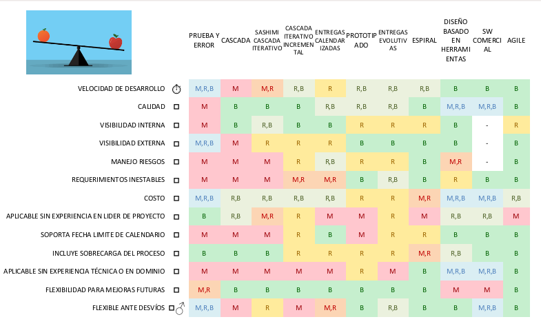