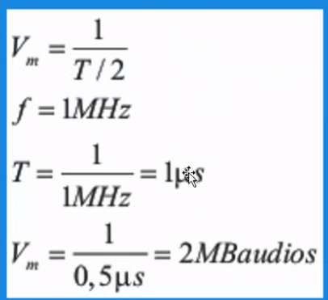
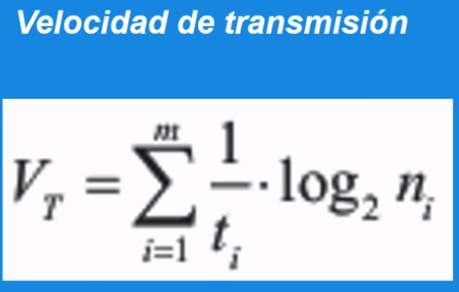
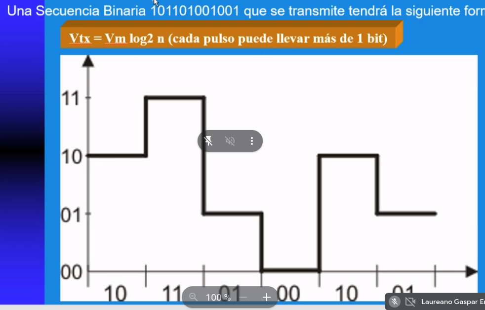
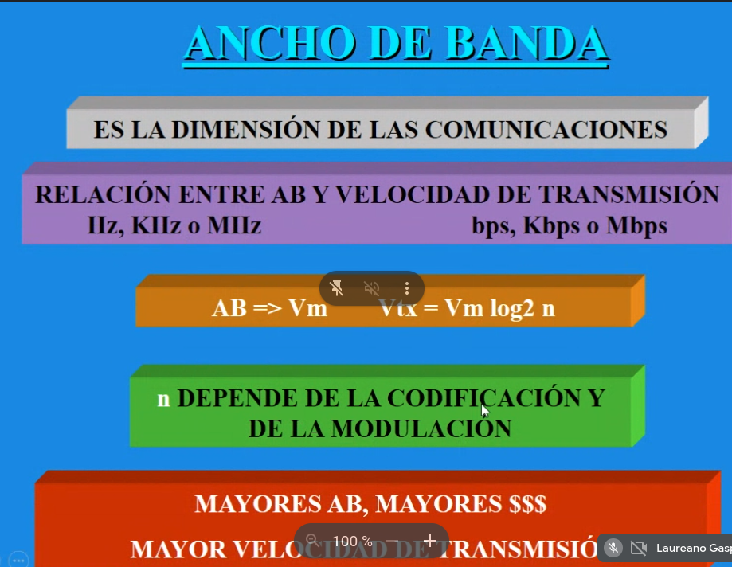
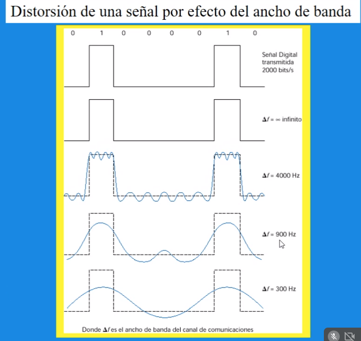

# Comunicaciones

### Senial analogica
* Es continua y no tiene saltos discretos, puede variar la densidad

### Senial digital
* Saltos discretos en su grafico, valores exactos
es densidad constante
Formas de captar una senial:
- Muestreo

* Frecuencia: son ciclos por segundo
 `ejemplo: si hago 2 ciclos en 1 segundo son 2HZ`
tambien entendida como:  velocidad del sonido/longitud de onda

* Longitud de onda: es de un pico de la onda a la otra

* Periodo: 
* Periodo de repeticion de pulso: es el tiempo entre el principio de un pulso y el comienzo de otro (usado en radares)

* Frecuencia de repeticion de pulsos: es el numero de pulsos que se transmite en 1 segundo

* Velocidad de modulacion: cantidad de bits por tiempo
`Vm= 1/(T/2)`

* Velociuad de transmision: 

### Transmision de multinivel
#### Que son los niveles? la cantidad de bit que estoy usando

los procedimientos utilizados son:
* Transmisiones multinivel
* Sistema de compresion de datos

Esto aumenta la velocidad de transmicion, sin aumentar la velocidad de modulacion

Ejemplo:

se estan transmitiendo 2 bits por pulso

### Protocolos

Conjunto de normas y procedimientos

Transmision en serie tiene:
* Protocolo asincornico: la base de tiempo entre el emisor y receptor no es la misma, siempre hay un bit de arranque (_start_)y bit de parada (_stop_). Tienen 2 clocks distintos

* Protocolo sincornico: los datos van de manera consecutiva y van de manera constante. Determinado por el clock del emisor, pero ambos clocks estan sincronizados

### Transmisiones
* Transmision en paralelo

### Codec

Es el codigo especifico se que usa para codificar y decodificar los datos, esta compuesto por
- numero de canales
- frecuencia de muestreo
- resolucion (numero de bits) (la precision con la que se muestra la senial original)
- bit rate 

### Fourier

nos permite transformar seniales entre el dominio del teimpo y el dominio de la frecuencia (es reversible)

Cualquier senial esta constituida por componentes senoidales de distintas frecuencias

Nos permite analizar la relacion entre las distintas funciones periodicas

### Ancho de banda

* Analgogicas: Es el intervalo de frecuencias en la que se concentra la mayor potencia de la senial

* En seniales digitales: es la cantidad de informacion que se puede enviar por un canal en un tiempo determinado

Distorsion por ancho de banda:

### 

* Capacidad de un canal: es la capacidad maxima que alcanzaria si no hubiera ruido
