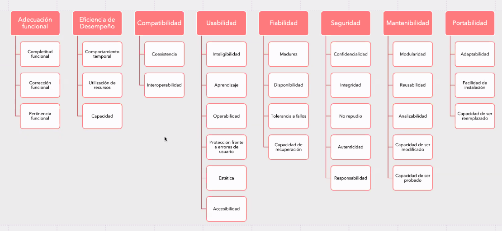

# Disenio de sistemas

__Calidad del producto__

1. Compatibilidad
1. Usabilidad
1. Fiabilidad
1. Seguridad
1. Mantenibilidad: la capacidad del produyto para ser modificado efectiva y eficientemente.
    1. Modularidad: permite que el cambio en un componente no afecte tanto a los demas
    1. Reusibilidad: capacidad de q un activo pueda ser usado en mas de un sistema
    1. Analizabilidad: lo facil que se puede evaluar el impacto de un cambio sobre el resto del software, ver deficiencias o poder identificar rapido las partes a modificar
    1. Capacidad para ser modificado

    1. Testeabilidad: El codigo tiene que ser facil de poder ser testeado

1. Portabilidad: Capcaidad de ser transferido de forma efectiva/eficiente de un lugar a otro.

1. Adecuacion funcional: 

1. Eficiencia de desempenio

## Cualidades de disenio

1. Simplicidad: 
    - KISS (Keep it simple, stupid)
    - YAGNI (You arent gonna need it)
1. Robustez: Ante un uso inadecuado o fallas internas, el sistema no debe comportarse de forma erratico, debe reportar los errores y volver a un estado consistente y facilitar la deteccion de la causa del problema. 
1. Flexibilidad
    - Extensibilidad: capacidad de agregar nuevas caracteristicas con poco impacto
    - Mantebilidad: capacidad de modificar las caracteristicas existentes con el menor esfuerzo posible

1. Acoplamiento: Es el grado de dependencia entre 2 componentes
    - `Cuanto mayor sea el acoplamiento entre 2 componentes, los cambios en uno de ellos impactara en mayor medida sobre el otro componente`
1. Cohesion : cantidad de responsabilidades que tiene asignado un componente de software
    - `Un componente es altamente cohesivo cuando sus responsabilidades asignadas no son muchas`
    - `Un componente es bajamente cohesivo cuando tiene muchas responsabilidades y no se entiende mucho que debe hacer`

## Patrones de disenio
Soluciones conocidas a problemas conocidos.
