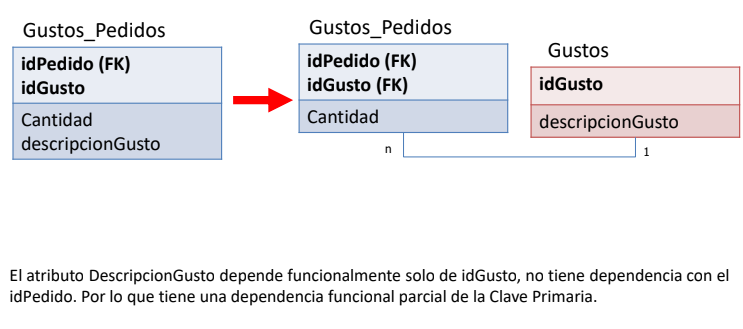
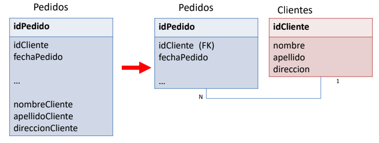

### Normalizacion
* Reducir redundancia de datos e incosistencias
* Evitar anomalias en manipulacion de datos
* Facilitar mantenimiento de datos
* Reducir impacto en los cambios de datos

#### Formas de normalizacion
1. No puede tener campos repitidos 
1. Si y solo si no hay dependencias funcionales entre atributos claves. 

1. Si y solo si no hay denpendencias funcionales entre los atributos no claves

### Tablas

* Unidad basica de almacenamiento de datos con filas y columnas